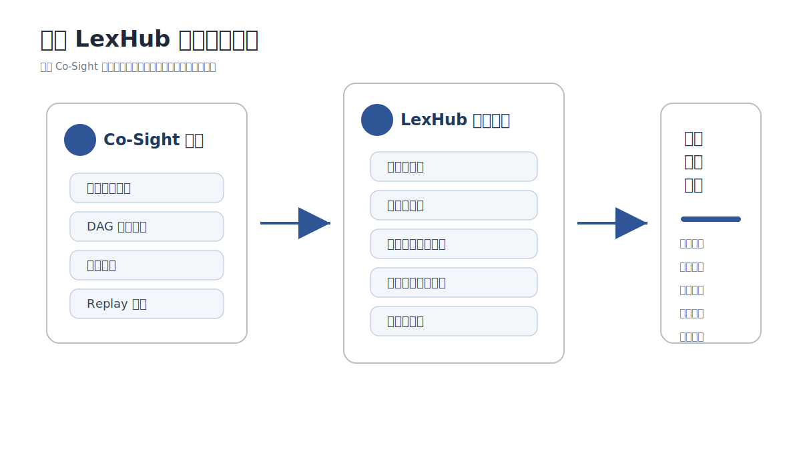
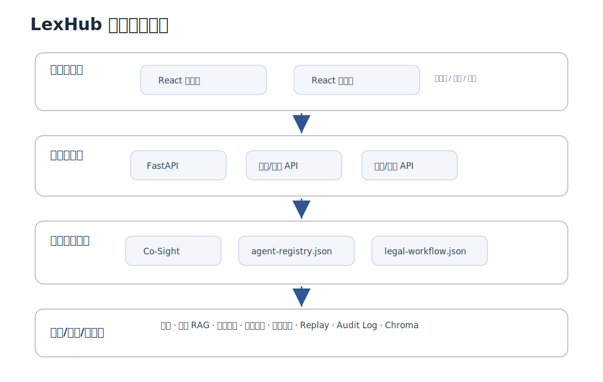
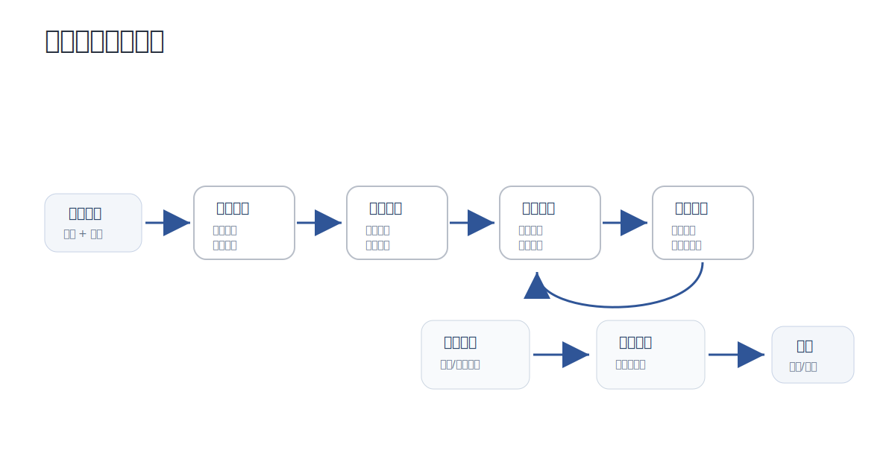

# 律枢 LexHub 国赛参赛交付文档

## 1. 项目概述

律枢 LexHub 是基于 Co-Sight 超级智能体框架二次开发的法律行业智能体协同平台，参赛赛道为“赛道六：开放创新”。系统面向合同审查、劳动争议、公司治理、数据合规、法规研究、文书起草等法律高频任务，构建“材料接入、任务拆解、法规检索、文书生成、交叉审查、审计归档”的完整闭环。

项目继承 Co-Sight 的多智能体协同、DAG 任务编排、工具调用、WebSocket 实时执行和 replay 回放能力，并在此基础上扩展法律智能体、法规知识库、材料库、文书导出、执行快照、审计日志和管理端配置能力。LexHub 的目标不是替代法律专业判断，而是把法律辅助工作中重复、耗时、难复盘的部分结构化、工具化和可追溯化，最终形成可由专业人员复核的智能交付物。

表 1-1 项目基本信息

| 项目项 | 内容 |
|---|---|
| 项目名称 | 律枢 LexHub |
| 参赛赛道 | 赛道六：开放创新 |
| 行业方向 | 法律行业智能化 |
| 技术底座 | Co-Sight 开源超级智能体框架 |
| 核心目标 | 让复杂法律任务可编排、可追溯、可复核、可交付 |
| 典型用户 | 个人律师、律所团队、企业法务、合规人员 |

图 1-1 项目定位总览图  


图注：图 1-1 展示 LexHub 与 Co-Sight 的关系。Co-Sight 提供多智能体协同、DAG 编排、工具调用和 Replay 回放等底座能力，LexHub 在此基础上进行法律行业增强，形成面向合同审查、争议解决、公司治理、数据合规和法规研究的任务交付平台。

```text
Co-Sight 超级智能体底座
  -> 多智能体协同 / DAG 编排 / 工具调用 / Replay 回放
LexHub 法律行业增强
  -> 法律智能体 / 法规知识库 / 材料库 / 文书导出 / 审计链
法律任务交付
  -> 合同审查 / 争议解决 / 公司治理 / 数据合规 / 法规研究
```

## 2. 场景价值

法律任务通常存在材料分散、事实链复杂、法规检索耗时、AI 输出难复核、文书交付依赖人工整理等问题。LexHub 将法律任务拆解为多智能体协作流程，使系统能够围绕材料、证据、法规、风险和最终文书进行结构化处理。

与普通问答式 AI 工具不同，LexHub 强调任务过程本身的可视化与可审计：用户不仅能看到最终结论，还能看到系统经过哪些智能体、调用了哪些工具、引用了哪些依据、生成了哪些阶段性结果。这一点更符合真实法律工作的交付要求。

表 2-1 业务痛点与系统能力对应

| 业务痛点 | 传统处理方式 | LexHub 解决方式 |
|---|---|---|
| 材料多且分散，人工梳理耗时 | 人工阅读 PDF、表格、文书并整理事实 | 支持材料上传与材料库归档，由证据质检智能体提取事实和缺口 |
| 法规引用难追溯 | 人工检索法规和案例，引用来源分散 | 法规研究智能体调用法律 RAG、外部搜索和本地知识库 |
| AI 生成结果缺少过程依据 | 只得到一段文本，难以复核过程 | replay、执行快照、审计日志记录完整执行过程 |
| 文书初稿整理成本高 | 人工复制材料、整理模板、生成报告 | 文书生成智能体输出结构化报告，并支持 DOCX/PDF 导出 |
| 法律结论需要专业复核 | 依赖律师逐项检查事实和依据 | 交叉审查智能体检查事实一致性、引用匹配和风险提示 |

表 2-2 典型应用场景

| 场景 | 输入材料 | 系统输出 |
|---|---|---|
| 劳动争议 | 解除劳动合同通知书、考勤记录、工资明细、仲裁草稿 | 事实时间线、争议焦点、证据缺口、仲裁建议 |
| 公司治理 | 董事辞任函、股权结构说明、股东会决议、章程摘录 | 主体关系梳理、治理风险、决议合规性分析 |
| 数据合规 | 行政约谈通知、SDK 数据清单、投诉转办、影响评估摘要 | 合规问题识别、法规依据、整改建议 |
| 合同审查 | 合同正文、补充协议、履约凭证 | 风险清单、条款建议、审查报告 |

图 2-1 法律任务处理前后对比图  


图注：图 2-1 对比传统法律任务处理方式与 LexHub 的处理方式。传统流程中材料阅读、法规检索、文书整理和复核记录相互分散；LexHub 将材料接入、证据质检、法规研究、文书生成和审计归档纳入同一工作台，形成可追溯的闭环。

## 3. 技术方案

### 3.1 总体架构

LexHub 采用“前端交互、后端服务、智能体编排、工具与知识库、可信审计”分层架构。前端负责场景化任务受理和过程展示；后端负责 Co-Sight 执行接入、材料管理、知识库服务、文书导出和审计接口；智能体层负责根据任务状态动态调度；工具层负责搜索、法规检索、文档处理、代码执行、导出等能力；可信层负责记录 replay、执行快照和审计日志。

图 3-1 系统总体架构图  


图注：图 3-1 展示 LexHub 的整体技术架构。系统上层为 React 用户端和管理端，中间通过 FastAPI 后端连接材料、文书、审计等业务服务，下层复用 Co-Sight 智能体编排能力，并接入搜索、法规 RAG、文档处理、导出和审计等工具与数据能力。

```text
用户交互层
  React 用户端：工作台、任务执行、任务结果、材料库、回放
  React 管理端：模型/API 配置、知识库、策略规则、用户管理

智能体编排层
  Co-Sight Planner / Actor
  法律智能体注册表 config/agent-registry.json
  法律 DAG 工作流 config/legal-workflow.json

工具与知识层
  联网搜索、法规 RAG、文档处理、代码执行、文书导出、审计日志

可信与数据层
  replay.json、execution snapshot、audit log、Chroma 本地知识库
```

表 3-1 核心工程模块

| 模块 | 路径 | 作用 |
|---|---|---|
| 前端用户端 | `Co-Sight-master/cosight_frontend/src/pages/` | 工作台、任务执行、结果页、材料库、回放页 |
| 前端管理端 | `Co-Sight-master/cosight_frontend/src/pages/admin/` | 模型/API、知识库、策略、用户管理 |
| 后端 API | `Co-Sight-master/cosight_server/deep_research/routers/` | 上传、知识库、文书、审计等接口 |
| 法律知识库 | `Co-Sight-master/cosight_server/deep_research/services/legal_kb/` | 法规、模板、类案检索 |
| 法律工具 | `Co-Sight-master/app/cosight/tool/legal_search_toolkit.py` | Co-Sight Actor 可调用的法律检索工具 |
| 工作流配置 | `Co-Sight-master/config/legal-workflow.json` | 法律任务 DAG 编排 |
| 智能体注册 | `Co-Sight-master/config/agent-registry.json` | 智能体角色、工具、触发条件 |

### 3.2 多智能体协同

LexHub 设计了 6 类法律智能体。各智能体不是简单串行调用，而是根据任务描述、材料完整度、法规引用覆盖率、风险等级和用户目标动态触发。这样的设计使系统能够处理不同类型法律任务，而不是局限于固定表单流程。

表 3-2 智能体分工

| 智能体 | 职责 | 典型触发条件 |
|---|---|---|
| 任务理解智能体 | 识别场景、拆解任务、生成调度建议 | 用户提交任务 |
| 证据质检智能体 | 分析上传材料，提取事实、证据缺口和材料完整度 | 材料不足或事实不清 |
| 法规研究智能体 | 检索法规、案例、模板和公开资料，形成引用依据 | 法规引用不足或争议复杂 |
| 文书生成智能体 | 生成法律分析报告、合同审查报告、律师函等草稿 | 用户需要报告、函件或意见书 |
| 交叉审查智能体 | 复核事实一致性、引用匹配和幻觉风险 | 高风险或导出前 |
| 合规监测智能体 | 导出前生成审计链、合规提示和归档摘要 | 导出前或合规关键词触发 |

图 3-2 多智能体协作流程图  


图注：图 3-2 展示一次法律任务在多智能体之间的协作关系。用户提交任务和材料后，系统依次完成任务理解、证据质检、法规研究、文书生成、交叉审查和合规监测，并将最终结果导出或归档。

代码 3-1 智能体注册表节选  
用途：展示智能体不是只在文档中描述，而是在配置文件中注册了角色、工具和触发条件。  
来源：`config/agent-registry.json`

```json
{
  "id": "research",
  "name": "法规研究智能体",
  "role": "worker",
  "capabilities": ["法规检索", "类案研究", "公开资料补充", "引用溯源"],
  "registeredTools": ["legal_rag", "tavily_search", "search_google", "search"],
  "triggers": ["法规引用缺失", "场景=法规研究"]
}
```

### 3.3 DAG 编排

系统通过 `config/legal-workflow.json` 定义法律任务 DAG。典型链路为：

```text
任务理解
  -> 证据质检
  -> 法规研究
  -> 文书生成
  -> 交叉审查
  -> 合规监测
  -> 归档导出
```

该链路体现了国赛要求中的多跳推理、条件分支和多智能体协作。以劳动争议任务为例，系统先识别用户目标，再判断材料是否完整；如材料缺失则进入证据质检，如法规引用不足则进入法规研究；当用户需要仲裁分析或报告时进入文书生成；最终在导出前触发交叉审查和合规监测。

表 3-3 DAG 分支规则

| 条件 | 触发节点 | 说明 |
|---|---|---|
| 材料完整度低于 70% | 证据质检 | 优先补齐事实和证据缺口 |
| 法规引用覆盖低于 55% | 法规研究 | 补充法规、案例和来源 |
| 用户需要报告、律师函、意见书 | 文书生成 | 生成结构化文书草稿 |
| 高风险或导出前 | 交叉审查 | 复核事实、引用和风险 |
| 导出前或涉及合规关键词 | 合规监测 | 形成审计链和归档摘要 |

图 3-3 法律任务 DAG 编排图  


图注：图 3-3 展示 LexHub 的法律任务 DAG。证据质检和法规研究节点由材料完整度、引用覆盖率等条件触发；交叉审查和合规监测作为导出前的强制节点，保证法律结论在交付前经过复核和审计。

代码 3-2 法律工作流配置节选  
来源：`config/legal-workflow.json`

```json
{
  "id": "research",
  "label": "法规研究",
  "agent": "research",
  "condition": "citationCoverage < 55"
}
```

### 3.4 工具与知识库

LexHub 至少集成 6 类工具/API 能力，满足国赛“至少调用 3 类以上工具/API”的要求。法律场景中最核心的是法规检索和文档处理：前者保证结论有依据，后者保证材料能够进入智能体流程。

表 3-4 工具/API 能力

| 能力 | 实现 | 作用 |
|---|---|---|
| 联网搜索 | Tavily / Google / Search API 集成位 | 补充公开资料和主体信息 |
| 法规检索 | `legal_search_toolkit.py`、本地 Chroma、NPC 法规、得理法律 API 集成位 | 检索法规、案例、模板 |
| 文档处理 | 文件上传、文档读取、OCR/解析集成位 | 处理 PDF、DOCX、图片、表格 |
| 代码执行 | Co-Sight 内置代码执行能力 | 结构化整理、统计、格式转换 |
| 文书导出 | DOCX/PDF 导出服务 | 生成可交付报告 |
| 可信审计 | replay、execution snapshot、audit log | 记录执行链路与来源 |

图 3-4 法规检索与知识融合流程图  


图注：图 3-4 展示法规研究智能体的知识融合流程。系统将用户法律问题转化为检索查询，同时访问本地法规库、外部法规接口、模板类案库和联网搜索结果，再经过去重、排序和摘要整合，输出可追溯的法规、案例和来源信息。

代码 3-3 法律检索工具节选  
来源：`app/cosight/tool/legal_search_toolkit.py`

```python
def legal_search(query: str, limit: int = 5) -> str:
    """混合法规检索：得理 API + NPC 公开库 + 本地 Chroma。"""
    from cosight_server.deep_research.services.legal_kb.legal_search import hybrid_legal_search
    data = hybrid_legal_search(query, limit=min(max(limit, 1), 10))
    return format_legal_search_result(data)
```

## 4. 核心功能与系统展示

LexHub 的核心功能围绕一次法律任务的完整办理过程展开。用户从工作台提交任务和材料，系统基于 Co-Sight 进行任务拆解与智能体调度，在执行过程中展示 DAG、阶段进展和工具调用，最终形成结构化结论、可导出文书和可回放的执行记录。

表 4-1 核心功能与展示页面

| 功能 | 页面入口 | 说明 |
|---|---|---|
| 场景化任务受理 | `/workspace` | 用户选择法律场景，填写任务描述，上传案件材料 |
| 智能体执行视图 | `/workspace/run` | 展示不同智能体的触发状态、执行阶段和协作流程 |
| DAG 可视化 | `/workspace/run` | 展示任务节点、执行顺序、条件分支和阶段进展 |
| 工具调用轨迹 | `/workspace/run` | 展示搜索、法规检索、文档处理、导出等工具调用过程 |
| 结构化结果 | `/workspace/result` | 展示事实、法规依据、风险提示和下一步建议 |
| 文书导出 | `/workspace/result` | 生成结构化报告草稿，并支持 DOCX/PDF 导出 |
| 归档回放 | `/replay` | 通过 replay 查看任务完整执行过程 |
| 管理端配置 | `/admin`、`/admin/connections`、`/admin/knowledge` | 配置模型/API、知识库、策略规则和用户信息 |

### 4.1 推荐演示路线

```text
登录系统
  -> 智能工作台提交任务
  -> 上传测试材料
  -> 查看任务执行过程
  -> 展示 DAG、智能体、工具轨迹
  -> 查看结构化结果
  -> 导出 DOCX/PDF 文书
  -> 查看归档与回放
  -> 进入管理端展示模型/API/知识库配置
```

### 4.2 运行演示说明

在劳动争议演示用例中，用户上传解除劳动合同通知书、考勤记录、工资及加班费明细、劳动仲裁申请草稿等材料，并输入任务目标。系统首先由任务理解智能体识别任务类型和目标产出，随后根据材料完整度和法规引用覆盖情况调度证据质检智能体与法规研究智能体。

执行过程中，`/workspace/run` 页面展示 DAG 节点状态、智能体阶段、工具调用轨迹和阶段性输出；`/workspace/result` 页面汇总事实摘要、争议焦点、法规依据、风险提示和下一步建议，并提供文书导出入口；`/replay` 页面保留任务执行记录，使评审人员能够复核系统如何从输入材料逐步形成最终结论。

表 4-2 功能演示闭环

| 环节 | 页面入口 | 系统表现 |
|---|---|---|
| 任务受理 | `/workspace` | 选择法律场景、填写任务描述、上传案件材料 |
| 过程执行 | `/workspace/run` | 展示 DAG 节点、智能体状态、工具调用和阶段结果 |
| 结果交付 | `/workspace/result` | 输出结构化结论、法规依据、风险提示和可导出文书 |
| 过程复盘 | `/replay` | 回放执行记录，查看阶段事件和工具调用 |
| 能力配置 | `/admin/connections`、`/admin/knowledge` | 管理模型/API、搜索能力、法规知识库和模板资源 |

### 4.3 演示测试材料

表 4-3 演示测试材料

| 目录 | 场景 | 展示方式 |
|---|---|---|
| `test/case-01-labor-dispute/` | 劳动争议：解除、工资、考勤、仲裁 | 推荐作为主演示案例 |
| `test/case-02-corporate-governance/` | 公司治理：董事辞任、股权结构、股东会决议 | 作为多场景扩展示例 |
| `test/case-03-data-compliance/` | 数据合规：个人信息保护、SDK 披露、监管整改 | 展示合规类任务能力 |

## 5. 效果评估

LexHub 的评估重点不是单一模型准确率，而是法律任务整体处理效率、引用可追溯性、过程可复核性和交付完整性。当前指标为演示基准，可在正式提交前结合实际运行截图和任务输出进一步补充。

表 5-1 效果评估指标

| 指标 | 传统方式 | LexHub 演示基准 | 效果 |
|---|---|---|---|
| 单任务处理时间 | 约 45 分钟 | 约 12 分钟 | 约 73% 时间节省 |
| 引用可追溯率 | 约 60% | 约 88% | 提升约 28 个百分点 |
| 过程复核 | 人工分散记录 | replay 全链路归档 | 可完整回放 |
| 文书初稿形成 | 人工整理 | 自动生成并导出 | 交付效率提升 |
| 工具调用可见性 | 不透明 | 工具轨迹可视化 | 便于审查 |

图 5-1 性能对比图  


图注：图 5-1 从处理效率、引用追溯、过程复核和交付效率四个维度对比传统方式与 LexHub 演示基准。该图用于说明 LexHub 的价值不仅体现在最终文本生成，还体现在任务处理链路、证据依据和交付过程的整体提升。

运行效果可通过任务完成状态、工具调用数量、阶段结果、导出状态和 replay 记录进行汇总展示。该部分用于说明系统不只生成最终文本，还保留了从任务输入到结果交付的全过程数据。

## 6. 创新点

表 6-1 创新点总结

| 创新点 | 说明 | 支撑材料 |
|---|---|---|
| 法律任务状态驱动调度 | 根据材料完整度、法规引用、风险等级和目标产出动态调度智能体 | `legal-workflow.json`、图 3-3 |
| Co-Sight DAG 法律行业化 | 将通用 DAG 编排落地为法律业务条件分支和导出前审查流程 | 图 3-3、代码 3-2 |
| 法规 RAG 与多源知识融合 | 整合法规库、模板库、类案线索、外部检索和本地向量库 | 图 3-4、代码 3-3 |
| 基于 replay 的可信交付 | 通过 replay、执行快照和审计日志支撑结果复核 | 表 4-2 |
| 一体化交付工作台 | 同时提供用户端、管理端、材料库、文书导出、测试材料和启动脚本 | 第 4 章 |

图 6-1 创新点与系统实现映射图  


图注：图 6-1 将项目创新点与具体系统实现对应起来。状态驱动调度对应工作流配置，DAG 行业化对应执行视图和流程规则，法规 RAG 对应法律检索工具，可信交付对应 replay、执行快照和审计日志，一体化工作台对应用户端与管理端功能闭环。

## 附录：参考材料

表 A-1 参考材料与项目文件

| 材料 | 路径/说明 |
|---|---|
| 国赛赛题 PDF | `docs/中兴捧月星匠师巧匠精英挑战赛-超级智能体开发大赛国赛赛题.pdf` |
| 项目 README | `README.md` |
| Co-Sight 原生项目 | `Co-Sight-master-raw/Co-Sight-master/` |
| LexHub 主工程 | `Co-Sight-master/` |
| 法律工作流配置 | `Co-Sight-master/config/legal-workflow.json` |
| 智能体注册表 | `Co-Sight-master/config/agent-registry.json` |
| 法律检索工具 | `Co-Sight-master/app/cosight/tool/legal_search_toolkit.py` |
| 法律知识库种子 | `Co-Sight-master/config/knowledge/`、`work_space/knowledge_store/` |
| 演示测试材料 | `test/` |
| 原生对比说明 | `Co-Sight-master/docs/competition/lexhub-vs-cosight-comparison.md` |
