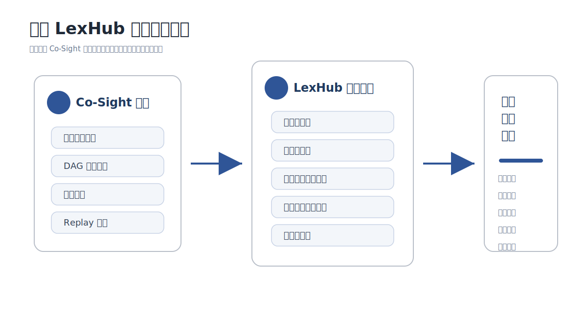
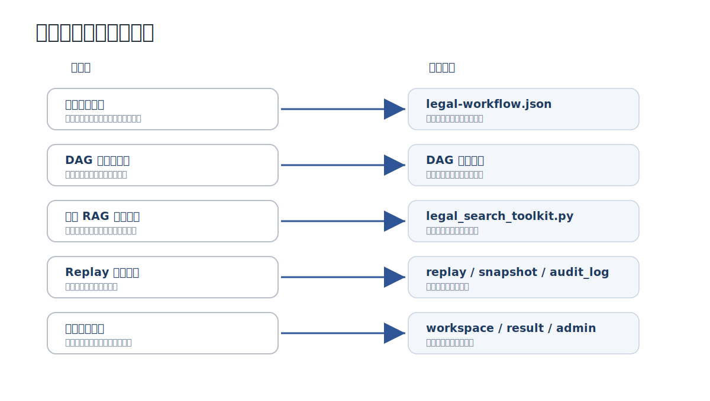

# 律枢 LexHub：基于中兴 Co-Sight 的法律业务智能服务平台创新总结报告

## 文档摘要

本文档对应国赛提交材料中的“创新总结报告”，围绕律枢 LexHub 的方案创新点、技术难点、推广应用前景和团队协作经验进行总结。律枢 LexHub 的正式定位为“基于中兴 Co-Sight 的法律业务智能服务平台”。报告重点说明项目在 Co-Sight 原生能力基础上完成的法律业务化改造，以及这些改造如何支撑可运行、可复核、可交付的法律任务工作流。

表 0-1 文档覆盖范围

| 必交内容 | 文档章节 |
|---|---|
| 方案创新点提炼（≤5 条） | 第 2 章 |
| 技术难点与解决方案 | 第 3 章 |
| 推广应用前景分析 | 第 4 章 |
| 团队协作经验分享 | 第 5 章 |

## 目录

- [文档摘要](#文档摘要)
- [1. 方案概述](#1-方案概述)
- [2. 方案创新点](#2-方案创新点)
- [3. 技术难点与解决方案](#3-技术难点与解决方案)
  - [3.1 法律任务难以固定流程化](#31-法律任务难以固定流程化)
  - [3.2 法律结论需要来源依据](#32-法律结论需要来源依据)
  - [3.3 模型执行过程难以复核](#33-模型执行过程难以复核)
  - [3.4 演示系统需要可运行、可讲解、可交付](#34-演示系统需要可运行可讲解可交付)
- [4. 推广应用前景](#4-推广应用前景)
- [5. 团队协作经验](#5-团队协作经验)
- [6. 总结](#6-总结)

## 1. 方案概述

律枢 LexHub 是基于中兴 Co-Sight 超级智能体框架二次开发的法律业务智能服务平台，面向合同审查、劳动争议、公司治理、数据合规、法规研究、文书起草等场景，构建“材料接入、任务拆解、法规检索、文书生成、交叉审查、审计归档”的完整闭环。

项目的核心目标是将 Co-Sight 的多智能体协同、DAG 任务编排、工具调用和 replay 回放能力行业化，使法律任务不再只是“模型问答”，而是可编排、可追溯、可复核、可交付的智能工作流。

法律行业对模型输出的要求与普通内容生成不同。法律任务往往需要同时回答三个问题：事实是否清楚，依据是否可靠，过程是否可复核。LexHub 围绕这三个问题组织系统能力：通过材料上传和证据质检处理事实，通过法规 RAG 和外部检索补充依据，通过 replay、执行快照和审计日志保留过程。系统最终输出的是可供专业人员复核的辅助结论，而不是不可追溯的单次回答。

本项目的开发思路是“保留 Co-Sight 底座，扩展法律行业层”。底层继续使用 Co-Sight 的多智能体、DAG、工具调用和回放能力；行业层增加法律智能体、法规知识库、材料库、文书导出、管理端配置和测试材料。这样的设计既避免重复造框架，也使法律场景能力可以通过工作流和知识库持续扩展。

表 1-1 项目建设内容

| 建设方向 | 具体内容 | 项目体现 |
|---|---|---|
| 用户端工作台 | 任务提交、材料上传、DAG 执行、结果展示、回放复盘 | `/workspace`、`/workspace/run`、`/workspace/result`、`/replay` |
| 法律业务模块 | 案件、材料、证据、法规研究、审查、报告等页面 | `CasesPage`、`MaterialsPage`、`EvidencePage`、`ResearchPage`、`ReviewPage`、`ReportsPage` |
| 管理端配置 | 模型/API、知识库、策略规则、用户管理、运行分析 | `/admin/connections`、`/admin/knowledge`、`/admin/policies`、`/admin/users` |
| 智能体配置 | 任务理解、证据质检、法规研究、文书生成、交叉审查、合规监测 | `config/agent-registry.json` |
| 工作流编排 | 法律任务 DAG、条件触发、导出前审查和合规归档 | `config/legal-workflow.json` |
| 法律知识库 | 法规种子、本地向量检索、公开法规接口、外部法律 API 集成位 | `services/legal_kb/` |
| 可信交付 | replay、执行快照、审计日志、可信分级、文书导出 | `execution_snapshot.py`、`audit_log.py`、`document_export.py` |
| 演示材料 | 劳动争议、公司治理、数据合规三类材料 | `test/` |

从完成形态看，LexHub 已形成“页面、配置、服务、知识、材料、文档”六类交付物。页面用于展示业务流程，配置用于固化智能体和 DAG，服务用于连接知识库与审计导出，知识用于支撑法律依据，材料用于验证运行效果，文档用于说明方案和创新点。这种交付形态比单一模型调用或静态页面更适合国赛对可运行代码、工作流配置、自定义工具和创新总结的综合要求。

表 1-2 项目能力成熟度

| 能力层级 | 项目体现 | 价值 |
|---|---|---|
| 可运行 | 前后端工程、启动脚本、测试材料和页面闭环 | 评审可以看到系统真实运行路径 |
| 可配置 | 智能体注册表、法律工作流、管理端模型/API/知识库配置 | 场景和能力不固化在单一页面或提示词中 |
| 可扩展 | 法律知识库服务、自定义工具、文书导出服务 | 后续可继续增加法律场景、模板和外部接口 |
| 可复核 | replay、执行快照、审计日志、交叉审查 | 法律结论能够回到过程和依据中检查 |
| 可交付 | 技术方案、创新总结、测试材料、配置文件、工具代码 | 满足国赛对方案文档和可运行代码的综合要求 |

图 1-1 项目定位总览图  


图注：图 1-1 展示 LexHub 与 Co-Sight 的关系。Co-Sight 提供多智能体协同、DAG 编排、工具调用和 Replay 回放等底座能力，LexHub 在此基础上进行法律业务增强，形成面向合同审查、争议解决、公司治理、数据合规和法规研究的任务交付平台。

## 2. 方案创新点

本方案创新点控制在 5 条以内，对应赛题对智能体设计、任务分解、工具封装、知识融合和行业价值的要求。

表 2-1 创新点总结

| 创新点 | 说明 |
|---|---|
| 法律任务状态驱动调度 | 根据材料完整度、法规引用覆盖率、风险等级和目标产出动态调度智能体，避免固定流水线 |
| Co-Sight DAG 法律行业化 | 将通用 DAG 编排落地为法律业务条件分支、导出前审查和合规归档流程 |
| 法规 RAG 与多源知识融合 | 整合法规库、模板库、类案线索、外部检索和本地向量库，为结论提供可追溯依据 |
| 基于 replay 的可信交付 | 通过 replay、执行快照和审计日志支撑任务复盘、文书溯源和人工复核 |
| 一体化交付工作台 | 同时提供用户端、管理端、材料库、文书导出、测试材料和启动脚本，形成完整演示闭环 |

表 2-2 创新点与赛题要求对应关系

| 赛题关注点 | LexHub 对应能力 | 说明 |
|---|---|---|
| 智能体角色分工 | 六类法律智能体 | 任务理解、证据质检、法规研究、文书生成、交叉审查和合规监测分工明确 |
| DAG 流程图 | 法律任务工作流配置 | 使用 `legal-workflow.json` 固化节点、条件触发和导出前审查 |
| 工具/API 集成 | 法律检索、搜索、文档处理、导出和审计工具 | 通过工具目录和后端服务连接 Co-Sight 执行链路 |
| 核心算法说明 | 状态驱动调度、法规 RAG、Replay 快照解析 | 从任务状态、知识检索和过程溯源三方面支撑系统运行 |
| 可信安全设计 | replay、execution snapshot、audit log、权限边界 | 支撑过程复盘、文书溯源和配置隔离 |
| 可运行代码/模型 | 前后端工程、配置文件、工具封装、测试材料 | 形成可演示、可复核、可扩展的工程交付 |

表 2-3 创新点验证证据

| 创新点 | 验证证据 | 对应文件或页面 |
|---|---|---|
| 法律任务状态驱动调度 | 工作流中存在条件触发节点，运行时按材料、引用、风险和产出目标调度 | `config/legal-workflow.json`、`/workspace/run` |
| Co-Sight DAG 法律行业化 | DAG 节点对应法律业务环节，而非抽象步骤 | `config/legal-workflow.json`、DAG 执行视图 |
| 法规 RAG 与多源知识融合 | 法律检索工具返回法规、案例、本地知识库和模板信息 | `legal_search_toolkit.py`、`services/legal_kb/` |
| 基于 replay 的可信交付 | 任务执行过程可在回放页面复核，导出内容可关联执行快照 | `/replay`、`execution_snapshot.py`、`audit_log.py` |
| 一体化交付工作台 | 用户端、管理端、测试材料和启动脚本形成完整交付链路 | `/workspace`、`/admin`、`test/`、`start-lexhub.bat` |

表 2-4 创新点量化观察

| 观察维度 | 传统处理中的问题 | LexHub 的改进表现 |
|---|---|---|
| 任务耗时 | 材料阅读、检索和初稿整理由人工串联完成 | 任务拆解、法规检索和文书生成进入同一执行链路 |
| 依据追溯 | 法规和案例引用散落在检索记录、聊天记录和文档备注中 | 法规 RAG、工具轨迹和结果页共同保留来源线索 |
| 过程复核 | 复核依赖人工记忆和临时记录 | replay、执行快照和审计日志保留阶段过程 |
| 交付完整度 | 初稿、依据、风险提示和归档材料需要人工合并 | 结果页和导出服务统一组织结构化交付 |
| 评审可验证性 | 功能说明与代码证据容易脱节 | 每个创新点均可对应到配置、页面、服务或测试材料 |

表 2-5 功能模块与创新关系

| 功能模块 | 支撑的创新点 | 说明 |
|---|---|---|
| 智能工作台 | 法律任务状态驱动调度、一体化交付工作台 | 将场景选择、材料上传、任务描述和执行入口集中到同一工作区 |
| DAG 执行页 | Co-Sight DAG 法律行业化、基于 replay 的可信交付 | 展示任务节点、智能体状态、工具调用和阶段进展 |
| 法规研究模块 | 法规 RAG 与多源知识融合 | 对接本地知识库、公开法规来源、外部检索和来源摘要 |
| 审查与合规模块 | 基于 replay 的可信交付 | 导出前检查事实一致性、引用匹配和审计链状态 |
| 结果与报告模块 | 一体化交付工作台 | 汇总事实、依据、风险、建议和 DOCX/PDF 导出 |
| 管理端配置 | 法律任务状态驱动调度、法规 RAG 与多源知识融合 | 维护模型/API、知识库、策略规则和能力开关 |
| 测试材料集 | 评审可验证性 | 通过劳动争议、公司治理、数据合规三类材料验证流程适配能力 |

表 2-6 参赛展示价值

| 展示重点 | 对应系统能力 | 评审可观察点 |
|---|---|---|
| 多智能体不是静态概念 | 智能体注册、DAG 执行、阶段状态 | 执行页可看到不同阶段和智能体职责 |
| DAG 不是固定流程图 | 条件触发、导出前强制审查、合规监测 | `legal-workflow.json` 和执行页可相互印证 |
| 工具/API 有工程接入 | 法律检索、知识库、文书导出、审计接口 | 后端接口、工具目录和结果页输出可验证 |
| 法律场景有真实材料 | 三组 PDF 测试材料和 prompt | 可现场上传材料并运行任务 |
| 可信机制有过程支撑 | replay、execution snapshot、audit log | 可从回放和审计接口查看过程记录 |
| 项目具备交付完整性 | 技术方案、创新总结、配置、工具、测试材料 | 材料与代码能够互相对应 |

第一，状态驱动调度使法律任务不再被固定表单限制。不同案件的材料完整度、争议焦点和目标产出差异较大，如果所有任务都经过同样步骤，容易造成无效调用或遗漏复核。LexHub 将材料完整度、引用覆盖率、风险等级和是否需要输出文书作为调度条件，使系统能根据任务状态选择执行路径。

第二，DAG 行业化将 Co-Sight 的通用编排能力变成法律场景可理解的流程。系统中的节点不是抽象的“步骤一、步骤二”，而是任务理解、证据质检、法规研究、文书生成、交叉审查、合规监测等法律工作中可以解释的环节。评审人员和用户能够直接看到每个节点的职责和触发原因。

第三，法规 RAG 与知识融合解决了法律结论“依据在哪里”的问题。系统不仅将检索结果作为模型上下文，还保留法规、案例、模板和来源摘要，使结果页和导出文书具备可追溯线索。

第四，基于 replay 的可信交付使系统从“输出结果”扩展到“解释过程”。当结果需要复核时，可以查看任务执行过程、工具调用和阶段输出，定位结论来源。

第五，一体化工作台保证项目不是概念设计，而是能运行、能演示、能交付的系统。用户端展示任务流程，管理端承载模型和知识库配置，测试材料支撑现场复现，本地启动脚本降低部署门槛。

表 2-7 知识来源与创新边界

| 知识来源 | 在系统中的作用 | 创新边界 |
|---|---|---|
| 国家法律法规数据库 | 提供法律、行政法规、司法解释等权威法规基础 | 项目不重新生产法规文本，而是围绕检索、归档和引用溯源组织使用 |
| 国家行政法规库 | 支撑行政监管、合规整改和公司治理类任务 | 项目重点在合规任务流程化，不替代行政法规官方解释 |
| 最高人民法院指导性案例 | 支撑类案参考和裁判规则说明 | 案例用于辅助理解裁判尺度，最终适用仍需人工判断 |
| 中国裁判文书网 | 支撑公开文书检索、事实比对和案由分析 | 裁判文书只作为参考材料，不直接等同于本案结论 |
| 最高人民检察院指导性案例 | 支撑检察监督、公益诉讼、刑事和合规类参考 | 项目保留来源线索，避免脱离语境引用案例 |
| LexHub 本地知识库 | 保存法规种子、模板、测试材料和团队规则 | 本地知识用于提高检索效率和演示稳定性，不改变权威来源优先原则 |

图 2-1 创新点与系统实现映射图  


图注：图 2-1 将项目创新点与具体系统实现对应起来。状态驱动调度对应工作流配置，DAG 行业化对应执行视图和流程规则，法规 RAG 对应法律检索工具，可信交付对应 replay、执行快照和审计日志，一体化工作台对应用户端与管理端功能闭环。

## 3. 技术难点与解决方案

### 3.1 法律任务难以固定流程化

法律任务并非简单线性流程。不同案件的材料完整度、争议焦点、法规依据和目标产出不同，固定表单或固定流水线难以适配。

解决方案：LexHub 通过 `legal-workflow.json` 将法律任务抽象为可条件触发的 DAG 节点，并通过任务理解智能体识别场景、材料状态、引用覆盖和风险等级，实现动态调度。

具体而言，系统不把所有任务都强制走完整流程，而是先判断任务状态。材料不足时，证据质检优先；依据不足时，法规研究优先；用户明确需要报告、律师函或意见书时，才进入文书生成；高风险或导出前，再进入交叉审查和合规监测。这种处理方式更接近真实法律工作中的“先补事实、再找依据、最后形成文书”。

代码 3-1 DAG 条件分支节选  
来源：`config/legal-workflow.json`

```json
[
  { "id": "evidence", "label": "证据质检", "condition": "materialCompleteness < 70" },
  { "id": "research", "label": "法规研究", "condition": "citationCoverage < 55" },
  { "id": "review", "label": "交叉审查", "condition": "riskLevel == high || exportReady" },
  { "id": "compliance", "label": "合规监测", "condition": "exportReady == true" }
]
```

### 3.2 法律结论需要来源依据

法律场景不能只依赖模型生成结论，必须说明依据来自哪里、是否可追溯。

解决方案：系统封装 `legal_search_toolkit.py`，结合本地 Chroma 知识库、法规种子、模板类案和外部检索接口，形成多源知识融合链路，输出法规、案例、模板和来源摘要。

在结果组织上，系统尽量保留“事实 - 依据 - 建议”的对应关系。法规研究智能体输出的内容会进入后续文书生成和交叉审查环节，避免文书只给出结论而缺少来源。对于法律辅助系统而言，这种可追溯结构比单纯生成流畅文本更重要。

### 3.3 模型执行过程难以复核

普通模型工具往往只输出最终答案，缺少中间过程，评审和用户难以判断结论是否可靠。

解决方案：LexHub 复用 Co-Sight replay 能力，并扩展 execution snapshot 和 audit log，将阶段结果、工具调用、工作区路径和导出依据结构化记录，支持归档回放和人工复核。

这一设计使系统具备“事后解释”能力。若某一结论存在疑问，可以回到 replay 查看触发了哪些节点、调用了哪些工具、生成了哪些中间结果，而不是只能重新询问模型。对于涉及法律风险的输出，这种过程记录是可信交付的基础。

### 3.4 演示系统需要可运行、可讲解、可交付

国赛不仅要求方案设计，还要求可运行代码、工作流配置、工具封装和完整文档。

解决方案：项目提供前后端工程、法律工作流配置、智能体注册表、法律检索工具、知识库种子、测试材料和本地启动脚本，并设计 `/workspace -> /workspace/run -> /workspace/result -> /replay -> /admin` 的演示闭环。

演示闭环的重点是让评审看到系统真实运行路径：从材料上传开始，到 DAG 执行、工具调用、结果生成、文书导出和 replay 回放结束。这样可以避免系统只停留在页面展示或静态说明层面。

表 3-1 技术难点与解决方案

| 技术难点 | 解决方案 | 对应交付 |
|---|---|---|
| 法律任务非线性 | 状态驱动 DAG 调度 | `legal-workflow.json` |
| 法律结论需依据 | 法规 RAG 与多源知识融合 | `legal_search_toolkit.py`、知识库 |
| 过程难复核 | replay、execution snapshot、audit log | `/replay`、审计接口 |
| 现场演示复杂 | 一体化工作台与测试材料 | `/workspace`、`test/` |
| 工程配置分散 | 管理端配置模型/API/知识库 | `/admin/connections`、`/admin/knowledge` |

表 3-2 可信交付实现证据

| 可信要求 | 项目实现 | 证据位置 |
|---|---|---|
| 过程可回放 | 保存 replay 事件，并在回放页面展示阶段与工具轨迹 | `/replay`、`replay.json` |
| 执行可结构化 | 将 replay 解析为执行快照，用于结果展示和文书导出 | `execution_snapshot.py` |
| 日志可校验 | 审计条目通过前序 hash 和当前 payload 形成链式摘要 | `audit_log.py` |
| 权限有边界 | 用户端与管理端路由分离，模型/API 配置不暴露在普通任务入口 | `App.tsx`、`/admin/connections` |
| 导出有门禁 | 高风险或导出前进入交叉审查和合规监测节点 | `legal-workflow.json` |

表 3-3 创新验证证据

| 验证维度 | 系统证据 | 说明 |
|---|---|---|
| 多智能体协同 | `agent-registry.json`、执行页智能体状态 | 六类智能体具备明确角色、工具能力和运行阶段 |
| DAG 任务编排 | `legal-workflow.json`、DAG 执行视图 | 任务节点、条件分支和强制审查节点具备工程配置 |
| 法律知识接入 | `legal_search_toolkit.py`、`services/legal_kb/` | 法规 RAG、本地知识库和来源摘要共同支撑依据检索 |
| 可信过程回放 | `/replay`、`execution_snapshot.py`、`audit_log.py` | 阶段事件、工具调用、审计链和执行快照可用于复核 |
| 结果交付闭环 | `/workspace/result`、`document_export.py` | 结构化结论、法规依据、风险提示和 DOCX/PDF 导出形成交付链路 |

表 3-4 难点解决路径沉淀

| 难点类型 | 直接问题 | 解决路径 | 可复用经验 |
|---|---|---|---|
| 业务抽象 | 法律任务差异大，难以用固定流程覆盖 | 将任务拆成事实、依据、生成、审查和归档五类环节 | 先抽象共性流程，再通过条件节点适配不同场景 |
| 知识可信 | 法规来源、案例来源和模板来源混杂 | 区分权威公开来源、本地知识库和运行过程知识 | 知识库建设必须保留来源、类型和适用范围 |
| 工程集成 | Co-Sight 原生能力偏通用，法律功能需要行业化 | 使用配置、工具封装和服务模块扩展，不改动底层执行框架 | 保持底座稳定，行业能力独立演进 |
| 过程可信 | 结果文本难以解释执行过程 | 将 replay 解析为执行快照，并生成审计链 | 用过程记录支撑专业复核，而不是只展示最终答案 |
| 演示交付 | 评审需要看到可运行链路和代码证据 | 准备测试材料、页面闭环、配置文件和文档说明 | 参赛系统应让页面、配置、代码和文档互相印证 |

除上述难点外，项目还需要处理“通用框架能力”和“团队二次开发能力”的边界。我们在文档中明确区分 Co-Sight 原生能力与 LexHub 扩展能力：多智能体、DAG、工具调用和 replay 属于 Co-Sight 底座；法律智能体角色、法律工作流、法规检索工具、材料库、文书导出和管理端配置属于本项目行业化改造。

## 4. 推广应用前景

LexHub 的设计并不局限于单一法律任务，而是形成“行业工作流包 + 工具包 + 知识库包”的可复制范式。通过更换知识库、规则库和场景化工作流，可以扩展到更多法律细分场景，也可以迁移到其他强证据链、强审计要求的行业。

在法律行业内部，LexHub 可以先从标准化程度较高的任务切入，例如合同审查、劳动争议材料整理、公司治理材料核验、数据合规初筛等。这类任务材料类型相对稳定，输出格式较明确，适合通过工作流和模板逐步固化。随着知识库和规则库积累，系统可以扩展到更复杂的诉讼支持、尽职调查和企业合规管理。

在行业外部，LexHub 的方法也适用于审计、财税、保险理赔、监管合规等场景。这些场景同样依赖证据材料、规则依据、流程复核和文档交付，具备迁移基础。迁移时需要替换的是行业知识库、任务节点和文书模板，而多智能体协作、DAG 编排、工具调用和 replay 审计机制可以复用。

表 4-1 推广应用路径

| 应用对象 | 推广方式 | 预期价值 |
|---|---|---|
| 个人律师 | 标准法律任务工作台 | 提高材料整理、法规研究和初稿生成效率 |
| 中小律所 | 团队版部署 | 统一案件流程、模板和知识库 |
| 企业法务 | 私有化部署 | 支持合同审查、数据合规、公司治理等批量任务 |
| 法律科技厂商 | 二次封装 | 基于中兴 Co-Sight 与 LexHub 工作流形成行业解决方案 |
| 其他行业 | 工作流迁移 | 扩展到审计、财税、保险理赔、监管合规等场景 |

从商业化路径看，系统可以支持个人版、团队版和私有化部署三类形态。个人版强调低门槛使用和标准任务处理；团队版强调模板共享、知识库维护和任务归档；私有化部署强调数据隔离、权限控制和内部系统集成。

表 4-2 推广落地阶段

| 阶段 | 建设重点 | 适用对象 | 交付形态 |
|---|---|---|---|
| 演示验证阶段 | 跑通三类测试材料、稳定工作台闭环、补齐知识库种子 | 比赛评审、课程展示、内部验证 | 本地演示环境、技术方案文档、创新总结报告 |
| 小团队试用阶段 | 增加模板库、常见任务规则、团队案例归档 | 个人律师、小型法务团队 | 团队工作台、共享知识库、任务归档 |
| 私有化部署阶段 | 接入正式鉴权、数据隔离、内部知识库和审计存储 | 律所、企业法务、合规部门 | 内网部署、权限控制、审计报表 |
| 行业方案阶段 | 增加行业专属工作流、规则库和第三方系统接口 | 法律科技厂商、行业客户 | 行业工作流包、工具包、知识库包 |

表 4-3 可迁移能力

| 可迁移能力 | 法律场景体现 | 迁移到其他行业的方式 |
|---|---|---|
| 多智能体职责划分 | 调度、证据、研究、生成、审查、合规 | 替换为审计、财税、理赔等行业角色 |
| DAG 条件编排 | 材料不足、依据不足、高风险、导出前触发不同节点 | 替换为行业规则、风险等级和审批条件 |
| 知识库检索 | 法规、案例、模板和来源摘要 | 替换为政策、准则、合同、理赔规则等知识 |
| Replay 审计 | 保留阶段、工具、输出和审计链 | 用于合规审计、质量追踪和责任复盘 |
| 文档导出 | 法律分析报告、意见摘要、函件草稿 | 替换为审计底稿、整改报告、理赔意见等文档 |

## 5. 团队协作经验

本项目围绕“赛题要求、系统实现、演示交付”进行协作拆分。团队在开发过程中将国赛要求拆解为可实现能力点，并将能力点映射到页面、配置文件、工具代码和文档材料，避免系统功能与参赛材料脱节。

协作过程中，我们先明确项目不做通用型法律聊天助手，而是基于中兴 Co-Sight 做法律任务工作台。随后将赛题要求拆解为五类可验证能力：多智能体、DAG、工具/API、可信审计、可运行交付。每一类能力都对应具体文件或页面，减少“文档写了但系统没有体现”的风险。

前后端协作上，前端围绕演示路径组织页面，保证评审能够按顺序看到任务受理、执行过程、结果交付和回放归档；后端围绕执行链路组织接口，保证上传材料、知识库、导出、审计等能力能够被页面调用；文档侧则负责把代码、配置、页面和赛题要求对应起来。

表 5-1 团队协作分工

| 协作方向 | 工作内容 |
|---|---|
| 产品与场景设计 | 确定法律行业开放创新赛道定位，梳理合同审查、劳动争议、公司治理、数据合规等场景 |
| 前端实现 | 构建 React 用户端、任务执行页、结果页、材料库、管理端等界面 |
| 后端实现 | 接入 Co-Sight 执行链路，开发上传、知识库、文书导出、审计日志等接口 |
| 智能体与工具设计 | 设计法律智能体角色、DAG 工作流、法律检索工具和知识库结构 |
| 测试与交付 | 准备测试材料、演示路线、技术方案文档、创新总结报告和对比说明 |

团队经验中较重要的一点是尽早固定演示案例。我们选择劳动争议、公司治理、数据合规三类材料作为测试集，使系统开发能够围绕真实输入输出推进，而不是只围绕空页面和模拟数据开发。这样既提高了功能验证效率，也让最终文档中的场景描述更具体。

表 5-2 协作方法沉淀

| 方法 | 做法 | 效果 |
|---|---|---|
| 赛题要求拆解 | 将技术方案、可运行代码、演示视频、创新总结拆为不同交付项 | 避免只做功能而忽略提交材料 |
| 工程证据绑定 | 每个文档能力点都尽量绑定页面、配置、服务或测试材料 | 提升报告可信度，便于答辩时定位实现 |
| 测试材料先行 | 先确定劳动争议、公司治理、数据合规三类材料 | 让前后端开发围绕真实任务闭环推进 |
| 前后端同步演示路线 | 前端按工作台、执行页、结果页、回放页组织流程，后端按上传、知识库、导出、审计组织接口 | 减少页面展示和后端能力脱节 |
| 文档持续校准 | 根据工程实际调整技术方案和创新总结 | 保证最终材料与系统功能一致 |

表 5-3 交付完整性检查

| 检查项 | 对应内容 | 状态说明 |
|---|---|---|
| 技术方案文档 | 业务场景、架构、算法、可信安全、性能评估、功能演示 | 已形成正式报告框架 |
| 创新总结报告 | 创新点、技术难点、推广前景、团队协作 | 已形成正式报告框架 |
| 工作流配置 | `config/legal-workflow.json` | 已覆盖法律任务节点和条件触发 |
| 智能体配置 | `config/agent-registry.json` | 已覆盖六类法律智能体和工具目录 |
| 自定义工具 | `legal_search_toolkit.py` | 已封装法律检索工具入口 |
| 测试材料 | `test/case-01`、`case-02`、`case-03` | 已覆盖三类演示场景 |
| 可信记录 | replay、execution snapshot、audit log | 已具备过程复盘与审计说明基础 |

## 6. 总结

律枢 LexHub 的创新价值在于将 Co-Sight 的通用超级智能体能力落地到法律行业真实任务中。项目通过多智能体协作、DAG 编排、法规 RAG、文书导出和 replay 审计，将法律智能化应用从单次问答提升为可运行、可复核、可交付的行业智能体系统。

该方案具备可复制、可扩展和可私有化部署的潜力，既能服务个人律师和企业法务，也能作为法律科技行业智能体建设范式继续演进。

从参赛角度看，LexHub 同时覆盖了赛题要求中的多智能体协同、DAG 任务编排、工具/API 调用、知识融合、可信机制和可运行交付。从项目角度看，它提供了一条更稳妥的行业化路径：不把模型能力包装成不可解释的答案生成器，而是把模型、工具、知识库和审计记录组织为可复核的任务链路。这个方向更符合法律行业对效率、依据和责任边界的综合要求。

