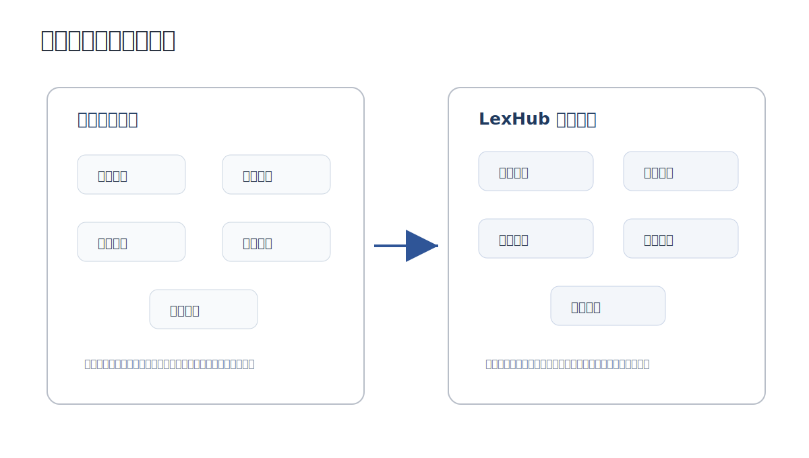
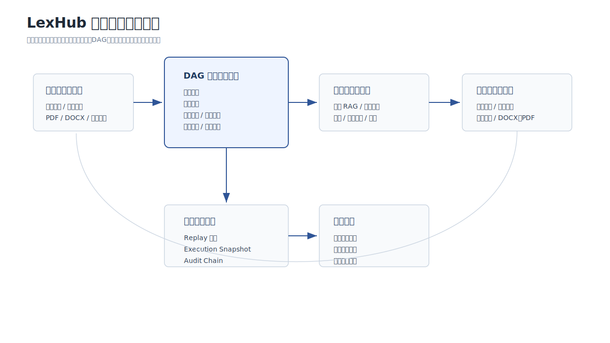
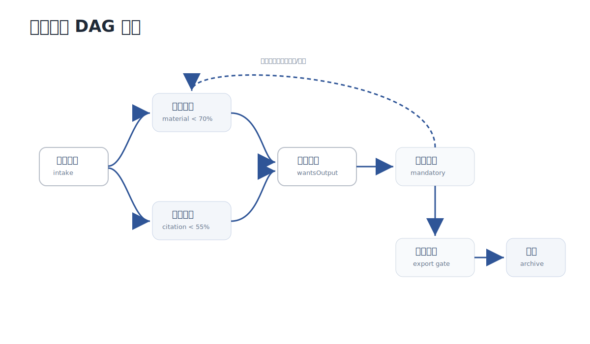
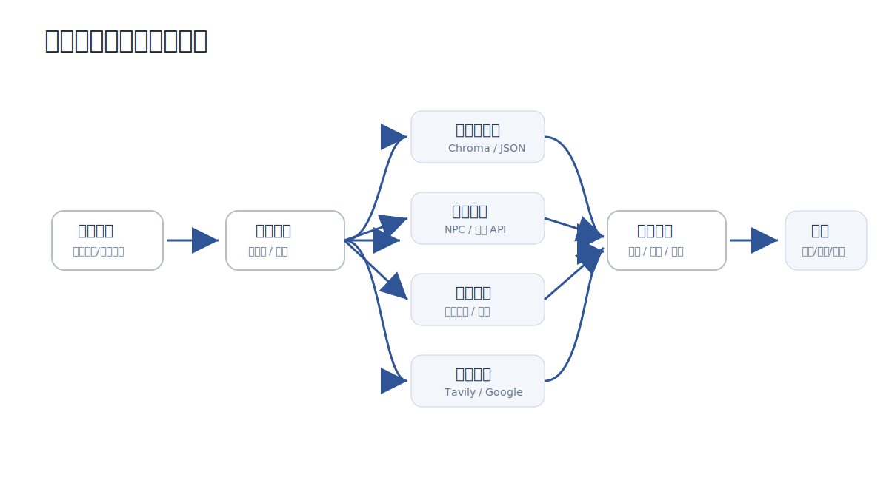
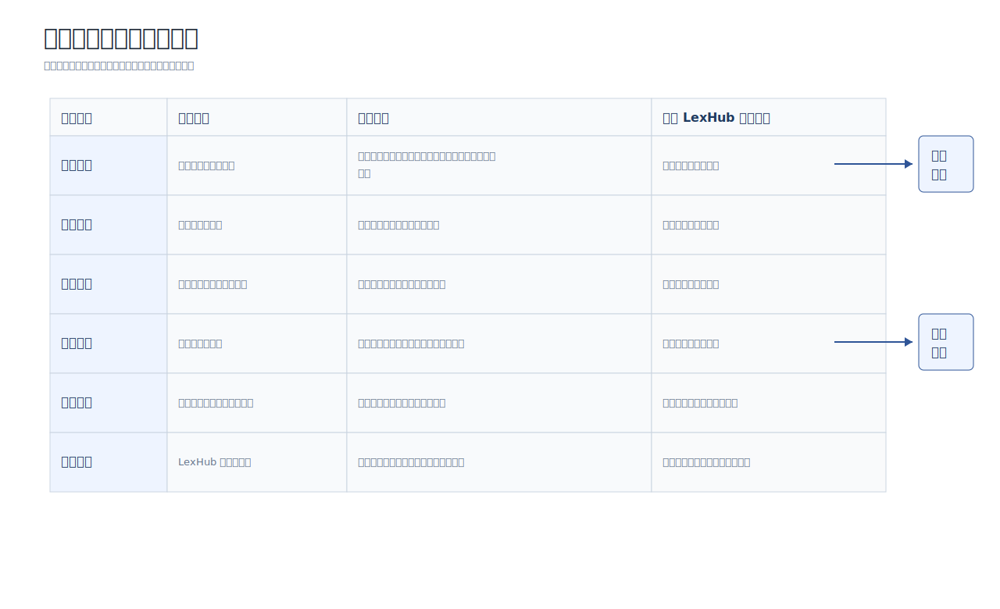
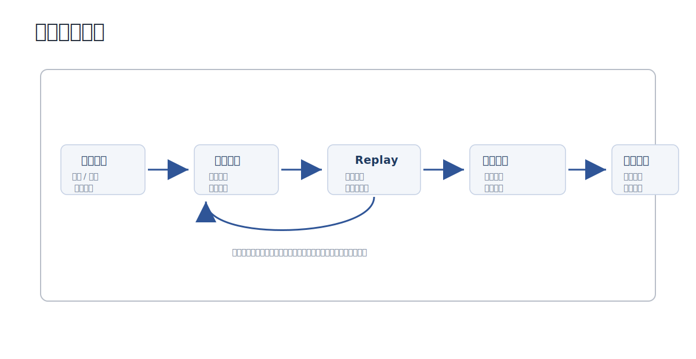
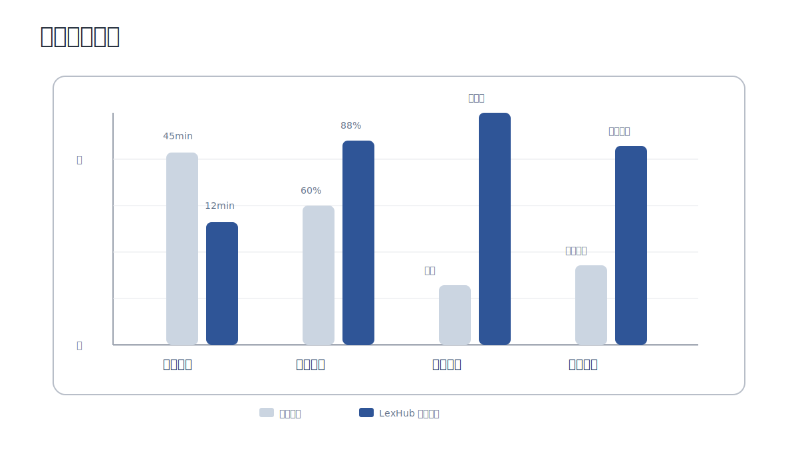
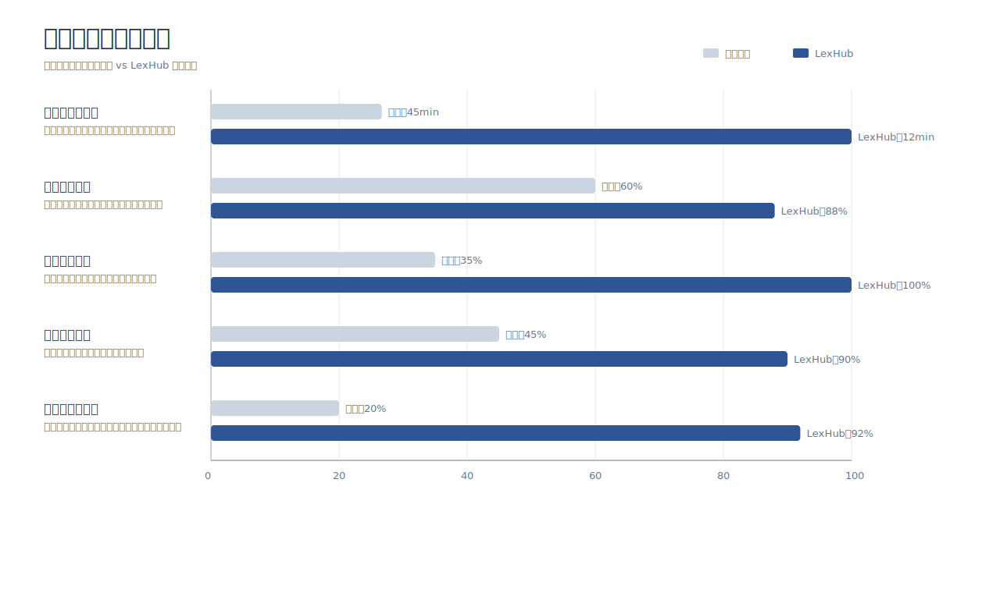
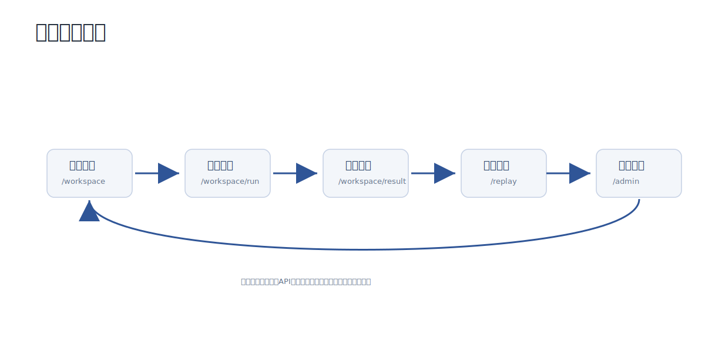
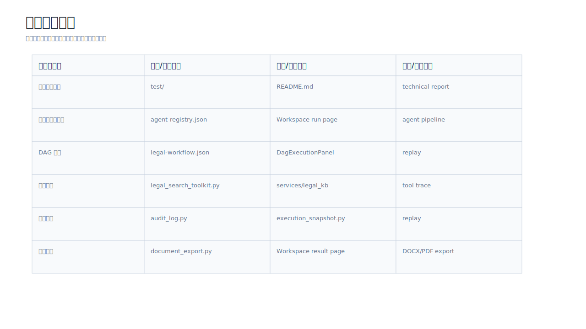

# 律枢 LexHub：基于中兴 Co-Sight 的法律业务智能服务平台技术方案文档

## 文档摘要

本文档对应国赛提交材料中的“技术方案文档”，围绕律枢 LexHub 的业务场景、系统架构、核心算法、可信安全、性能评估和功能演示进行说明。律枢 LexHub 的正式定位为“基于中兴 Co-Sight 的法律业务智能服务平台”，文档重点展示项目如何基于中兴 Co-Sight 开源框架落地多智能体协同、DAG 任务编排、工具/API 调用、法律知识融合和可回放审计链路。

表 0-1 文档覆盖范围

| 赛题建议项 | 文档章节 |
|---|---|
| 业务场景分析：痛点、用户画像、价值量化 | 第 1 章 |
| 技术架构设计：智能体、DAG、工具集成 | 第 2 章 |
| 核心算法说明：任务分解、协作机制、优化算法 | 第 3 章 |
| 可信安全设计：数据保护、权限控制、审计日志 | 第 4 章 |
| 性能评估报告：测试环境、基准结果、对比分析 | 第 5 章 |
| 系统运行效果和可运行交付物 | 第 6 章、附录 A |

## 目录

- [文档摘要](#文档摘要)
- [1. 业务场景分析](#1-业务场景分析)
  - [1.1 目标场景](#11-目标场景)
  - [1.2 业务痛点](#12-业务痛点)
  - [1.3 用户画像](#13-用户画像)
  - [1.4 价值量化](#14-价值量化)
- [2. 技术架构设计](#2-技术架构设计)
  - [2.1 总体架构](#21-总体架构)
  - [2.2 智能体角色分工](#22-智能体角色分工)
  - [2.3 DAG 流程图](#23-dag-流程图)
  - [2.4 工具集成方案](#24-工具集成方案)
  - [2.5 法律知识来源治理](#25-法律知识来源治理)
- [3. 核心算法说明](#3-核心算法说明)
  - [3.1 任务分解策略](#31-任务分解策略)
  - [3.2 智能体协作机制](#32-智能体协作机制)
  - [3.3 优化算法](#33-优化算法)
- [4. 可信安全设计](#4-可信安全设计)
  - [4.1 数据保护措施](#41-数据保护措施)
  - [4.2 权限控制方案](#42-权限控制方案)
  - [4.3 审计日志机制](#43-审计日志机制)
- [5. 性能评估报告](#5-性能评估报告)
  - [5.1 测试环境配置](#51-测试环境配置)
  - [5.2 基准测试结果](#52-基准测试结果)
  - [5.3 对比分析](#53-对比分析)
- [6. 功能演示与运行效果](#6-功能演示与运行效果)
  - [6.1 演示流程](#61-演示流程)
  - [6.2 功能演示闭环](#62-功能演示闭环)
  - [6.3 演示测试材料](#63-演示测试材料)
  - [6.4 运行效果说明](#64-运行效果说明)
- [附录 A：可运行代码与配置说明](#附录-a可运行代码与配置说明)
- [附录 B：参考资料](#附录-b参考资料)
- [附录 C：术语表](#附录-c术语表)

表 0-2 项目实现范围概览

| 实现方向 | 已落地内容 | 对应工程位置 |
|---|---|---|
| 法律任务工作台 | 场景选择、任务描述、材料上传、任务提交、执行页和结果页 | `cosight_frontend/src/pages/WorkspacePage.tsx`、`WorkspaceRunPage.tsx`、`WorkspaceResultPage.tsx` |
| 法律业务页面 | 案件、材料、证据、法规研究、审查、报告、回放等业务页面 | `CasesPage.tsx`、`MaterialsPage.tsx`、`EvidencePage.tsx`、`ResearchPage.tsx`、`ReviewPage.tsx`、`ReportsPage.tsx`、`ReplayPage.tsx` |
| 管理端能力 | 模型/API 配置、知识库维护、策略规则、用户管理、运行分析 | `cosight_frontend/src/pages/admin/` |
| 多智能体与 DAG | 六类法律智能体、条件触发节点、导出前审查和合规监测 | `config/agent-registry.json`、`config/legal-workflow.json` |
| 法律知识库 | 法规检索、本地向量库、NPC 法规接口、外部法律 API 集成位、任务知识回填 | `cosight_server/deep_research/services/legal_kb/` |
| 可信与交付 | replay 解析、执行快照、审计链、文书导出、指标聚合 | `execution_snapshot.py`、`audit_log.py`、`document_export.py`、`metrics_aggregator.py` |
| 演示材料 | 劳动争议、公司治理、数据合规三组材料与任务 prompt | `test/` |

从工程完成度看，LexHub 已不只是对 Co-Sight 原始界面的改名，而是在前端页面、后端服务、法律知识库、工作流配置、审计回放和演示材料上形成了独立的法律业务应用层。后续扩展可以继续沿用这一结构：新增场景时补充测试材料、知识库种子、工作流条件和结果模板；新增工具时补充 Actor 工具封装、后端服务和管理端配置入口。

## 1. 业务场景分析

### 1.1 目标场景

律枢 LexHub 面向法律业务中材料整理、法规研究、文书起草和过程复核等高频辅助工作，基于中兴 Co-Sight 超级智能体框架构建法律业务智能服务平台。系统覆盖合同审查、劳动争议、公司治理、数据合规、法规研究、文书起草等任务，形成“材料接入、任务拆解、法规检索、文书生成、交叉审查、审计归档”的完整闭环。

本方案选择法律行业作为开放创新赛道，是因为法律任务天然具备多材料、多依据、多角色复核的特点。一次常见法律任务通常同时涉及事实材料、法律条文、类案线索、业务规则和最终文书，单一问答式模型难以稳定覆盖完整过程。LexHub 将这些环节拆解为可观察、可配置、可回放的任务节点，使系统能够承担“辅助整理、辅助检索、辅助生成、辅助复核”的角色。

系统当前重点覆盖“法律辅助工作”而非替代专业判断。对于合同审查、劳动争议、公司治理和数据合规等场景，LexHub 输出事实摘要、证据缺口、法规依据、风险提示和文书初稿，最终结论仍保留人工复核入口。这一定位更符合真实法律业务中对审慎性、可解释性和责任边界的要求。

表 1-1 目标场景与系统能力

| 场景 | 典型输入材料 | 系统处理重点 | 典型输出 |
|---|---|---|---|
| 劳动争议 | 解除通知、考勤记录、工资明细、仲裁申请草稿 | 时间线梳理、工资与加班事实核对、解除依据检索 | 争议焦点、证据缺口、仲裁请求分析、风险提示 |
| 公司治理 | 公司章程、股权结构、股东会决议、董事辞任函 | 主体关系识别、决议程序检查、章程与公司法依据比对 | 治理合规分析、决议风险、补正建议 |
| 数据合规 | SDK 数据清单、个人信息影响评估、投诉转办、行政约谈通知 | 个人信息处理活动梳理、监管要求检索、整改事项归纳 | 合规风险清单、整改建议、法规依据 |
| 合同审查 | 合同正文、补充协议、履约材料 | 条款风险识别、违约责任分析、争议条款定位 | 条款审查意见、风险等级、修改建议 |
| 法规研究 | 法律问题描述、行业背景、检索关键词 | 多源法规检索、类案参考、来源摘要整理 | 法规依据、案例线索、适用说明 |

上述场景与项目测试材料、页面入口和工作流配置相互对应。其中劳动争议、公司治理和数据合规已准备成独立演示材料目录，便于在现场演示中用同一套流程验证不同法律任务的适配能力；合同审查和法规研究则主要体现系统的可扩展场景设计，可通过补充材料模板和知识库条目继续增强。

图 1-1 法律任务处理前后对比图  


图注：图 1-1 展示传统法律任务处理方式与 LexHub 的差异。传统流程中材料阅读、法规检索、文书整理和复核记录相互分散；LexHub 将这些环节纳入同一工作台，并通过多智能体协作形成可追溯任务链路。

图 1-2 LexHub 法律任务价值闭环图  


图注：图 1-2 展示 LexHub 从材料与任务输入，到 DAG 多智能体流程、法律知识与工具调用、结构化交付成果、可信过程记录和业务价值的闭环关系。该闭环说明项目价值不是单点文本生成，而是把法律任务办理所需的事实、依据、流程、审计和交付统一到同一系统中。

### 1.2 业务痛点

表 1-2 业务痛点与解决方式

| 业务痛点 | 传统处理方式 | LexHub 解决方式 |
|---|---|---|
| 材料多且分散，人工梳理耗时 | 人工阅读 PDF、表格、文书并整理事实 | 支持材料上传与材料库归档，由证据质检智能体提取事实和缺口 |
| 法规引用难追溯 | 人工检索法规和案例，引用来源分散 | 法规研究智能体调用法律 RAG、外部搜索和本地知识库 |
| 模型输出缺少过程依据 | 只得到一段文本，难以复核过程 | replay、执行快照、审计日志记录完整执行过程 |
| 文书初稿整理成本高 | 人工复制材料、整理模板、生成报告 | 文书生成智能体输出结构化报告，并支持 DOCX/PDF 导出 |
| 法律结论需要专业复核 | 依赖律师逐项检查事实和依据 | 交叉审查智能体检查事实一致性、引用匹配和风险提示 |

这些痛点本质上不是单点工具缺失，而是任务链路断裂。材料在文件夹中、法规在检索网站中、结论在聊天记录中、文书在 Word 模板中、复核记录在人工备注中，导致同一事项的上下文被分散保存。LexHub 的设计重点是将这些分散环节串联为同一工作区内的执行链路，并将阶段结果沉淀为可复盘记录。

表 1-3 能力价值映射

| 系统能力 | 对应痛点 | 价值体现 |
|---|---|---|
| 材料上传与材料库归档 | 材料分散、上下文难复用 | 将不同来源文件按任务统一归档，便于后续质检、生成和导出 |
| 证据质检智能体 | 事实不清、证据缺口难发现 | 自动整理材料清单、事实摘要和缺失项，降低前期人工梳理成本 |
| 法规 RAG 与搜索工具 | 法规引用分散、来源难追溯 | 输出法规标题、来源摘要和匹配结果，便于人工核验 |
| DAG 执行视图 | 办理过程不可见 | 将任务阶段、智能体状态和工具调用呈现为可观察过程 |
| Replay 与审计日志 | 复核记录分散 | 保留执行事件、工具调用和审计链，支持结果复盘 |
| 文书导出服务 | 文书整理耗时 | 将事实、依据、风险提示和执行摘要组织为可交付文档 |

### 1.3 用户画像

表 1-4 用户画像与核心需求

| 用户画像 | 核心需求 | LexHub 提供的能力 |
|---|---|---|
| 个人律师 | 快速梳理材料、提取争议焦点、生成初稿 | 智能工作台、材料上传、法规研究、文书导出 |
| 律所团队 | 统一任务流程、沉淀模板和审查标准 | 工作流配置、知识库、归档回放、审查规则 |
| 企业法务 | 批量处理合同、合规和公司治理问题 | 场景化任务受理、管理端配置、结构化结果 |
| 合规人员 | 保留处理依据、满足过程复核要求 | replay、审计日志、执行快照、导出附录 |

在使用方式上，个人律师更关注单次任务的效率和文书初稿质量；律所团队更关注模板、知识库和办理流程的统一；企业法务更关注批量合同或合规事项的可管理性；合规人员则更关注过程留痕和依据追溯。LexHub 将这些需求统一到“任务工作台 + 管理端配置 + 回放归档”的产品结构中。

### 1.4 价值量化

表 1-5 价值量化指标

| 指标 | 传统方式 | LexHub 演示基准 | 价值说明 |
|---|---|---|---|
| 单任务处理时间 | 约 45 分钟 | 约 12 分钟 | 材料整理、法规检索和初稿生成效率提升 |
| 引用可追溯率 | 约 60% | 约 88% | 输出结论更容易定位到法规、案例或来源 |
| 过程复核方式 | 分散记录 | replay 全链路归档 | 便于复盘智能体执行过程和工具调用 |
| 文书交付方式 | 人工整理 | 自动生成并导出 | 降低报告、意见书、函件初稿整理成本 |

上述指标为演示基准，用于说明系统在任务处理链路上的预期改进。正式生产环境中的指标会受到模型能力、知识库质量、案件复杂度、材料清晰度和人工复核标准影响，因此本项目在文档中将其表述为对比基准，而非最终生产承诺。

表 1-6 价值实现路径

| 价值方向 | 实现路径 | 可验证证据 |
|---|---|---|
| 效率提升 | 材料接入、任务拆解、法规检索和初稿生成由工作流串联 | 工作台、DAG 执行页、测试材料 |
| 质量提升 | 事实、依据、风险、建议分阶段生成并在导出前复核 | 交叉审查智能体、结果页、导出文书 |
| 可信提升 | replay、执行快照和审计日志记录过程 | `/replay`、`execution_snapshot.py`、`audit_log.py` |
| 可扩展性 | 场景、智能体、工具和知识库均通过配置或服务扩展 | `legal-workflow.json`、`agent-registry.json`、`services/legal_kb/` |
| 可交付性 | 前端、后端、配置、测试材料和文档形成完整提交材料 | 工程目录、附录 A、演示测试材料 |

## 2. 技术架构设计

### 2.1 总体架构

LexHub 采用“用户交互层、后端服务层、智能体编排层、工具与知识层、可信与数据层”的分层架构。前端负责场景化任务受理和过程展示；后端负责 Co-Sight 执行接入、材料管理、知识库服务、文书导出和审计接口；智能体层根据任务状态动态调度；工具层接入搜索、法规检索、文档处理、代码执行、导出等能力；可信层记录 replay、执行快照和审计日志。

该架构遵循“框架能力复用、行业能力外接、运行过程可见”的原则。Co-Sight 负责通用智能体执行底座，LexHub 不重写底层执行框架，而是在其上增加法律场景的工作流配置、工具封装、知识库服务和展示页面。这样既能保留 Co-Sight 的多智能体和 DAG 能力，也能让法律行业的业务逻辑以配置和服务模块的形式独立演进。

系统数据流从用户提交任务开始：前端将任务描述、场景类型和上传材料传入后端；后端将材料复制到任务工作区，并触发 Co-Sight 执行；执行过程中产生的阶段事件、工具调用、文件产物和模型输出被记录到 replay；任务完成后，结果页读取执行快照并组织结构化展示，同时支持文书导出和回放复核。

图 2-1 系统总体架构图  


图注：图 2-1 展示 LexHub 的整体技术架构。系统上层为 React 用户端和管理端，中间通过 FastAPI 后端连接材料、文书、审计等业务服务，下层复用 Co-Sight 智能体编排能力，并接入搜索、法规 RAG、文档处理、导出和审计等工具与数据能力。

表 2-1 核心工程模块

| 模块 | 路径 | 作用 |
|---|---|---|
| 前端用户端 | `Co-Sight-master/cosight_frontend/src/pages/` | 工作台、任务执行、结果页、材料库、回放页 |
| 前端管理端 | `Co-Sight-master/cosight_frontend/src/pages/admin/` | 模型/API、知识库、策略、用户管理 |
| 后端 API | `Co-Sight-master/cosight_server/deep_research/routers/` | 上传、知识库、文书、审计等接口 |
| 法律知识库 | `Co-Sight-master/cosight_server/deep_research/services/legal_kb/` | 法规、模板、类案检索 |
| 法律工具 | `Co-Sight-master/app/cosight/tool/legal_search_toolkit.py` | Co-Sight Actor 可调用的法律检索工具 |
| 工作流配置 | `Co-Sight-master/config/legal-workflow.json` | 法律任务 DAG 编排 |
| 智能体注册 | `Co-Sight-master/config/agent-registry.json` | 智能体角色、工具、触发条件 |

其中，`legal-workflow.json` 与 `agent-registry.json` 是系统从通用 Co-Sight 迁移到法律场景的核心配置。前者描述任务如何流转，后者描述有哪些智能体、它们具备什么能力、能调用哪些工具。两者结合后，系统才能在运行时解释“为什么触发某个节点、为什么调用某类工具、为什么进入导出前复核”。

表 2-2 前端功能页面

| 页面类别 | 主要页面 | 作用 |
|---|---|---|
| 任务办理 | `WorkspacePage`、`WorkspaceRunPage`、`WorkspaceResultPage` | 支撑任务提交、DAG 执行过程查看和结果交付 |
| 法律业务 | `CasesPage`、`DocumentsPage`、`MaterialsPage`、`EvidencePage` | 承载案件、文档、材料和证据相关信息 |
| 研究审查 | `ResearchPage`、`ReviewPage`、`ReportsPage` | 展示法规研究、交叉审查和报告结果 |
| 过程复盘 | `ReplayPage`、`AnalyticsPage` | 支撑执行过程回放和运行指标查看 |
| 智能体展示 | `AgentsPage`、`BoardPage` | 展示智能体能力、任务看板和流程状态 |
| 管理端 | `AdminConnectionsPage`、`AdminKnowledgePage`、`AdminPoliciesPage`、`AdminUsersPage` 等 | 管理模型/API、知识库、策略规则和用户信息 |

表 2-3 后端服务模块

| 服务模块 | 代表文件 | 作用 |
|---|---|---|
| 运行配置 | `admin_runtime_config.py` | 将管理端模型、API、工具配置应用到后端运行环境 |
| 法律知识库 | `legal_kb/legal_search.py`、`vector_store.py`、`npc_client.py` | 支撑本地向量检索、公开法规检索和外部法律 API 集成 |
| 材料与合同处理 | `contract_documents.py`、`document_research.py`、`document_generator.py` | 支撑材料读取、文档研究和法律文书生成 |
| 可信评估 | `credibility_analyzer.py`、`audit_log.py` | 支撑可信分级、审计链和过程复核 |
| 执行归档 | `execution_snapshot.py`、`metrics_aggregator.py` | 从 replay 中提取执行快照、阶段统计和运行指标 |
| 文书导出 | `document_export.py` | 支撑 Markdown、DOCX、PDF 等导出链路 |

表 2-4 后端接口能力矩阵

| 能力类别 | 代表接口 | 作用 |
|---|---|---|
| 材料上传 | `/upload/files` | 上传任务材料，生成 upload id 并登记材料元信息 |
| 能力总览 | `/demo/overview`、`/demo/legal-capabilities`、`/demo/toolchain-status` | 向前端提供场景、智能体、工具链和运行状态 |
| 动态调度 | `/demo/agent-routing`、`/demo/task-blueprint` | 根据场景和任务描述生成智能体调度建议与任务蓝图 |
| 配置读取 | `/demo/agent-registry`、`/demo/workflow-config` | 暴露智能体注册表和法律工作流配置，用于前端展示和调试 |
| 知识库管理 | `/demo/knowledge/ingest`、`/demo/knowledge/vector/search`、`/demo/legal-search` | 支撑知识导入、向量检索和法律检索 |
| 文书生成 | `/demo/generate-document`、`/demo/export-document`、`/demo/contract/documents/generate` | 生成法律报告、合同文档和 DOCX/PDF 导出文件 |
| 可信复盘 | `/demo/audit-log`、`/demo/execution-snapshot`、`/demo/review-result` | 提供审计链、执行快照和导出前复核结果 |
| 管理端配置 | `/demo/admin/settings`、`/demo/admin/settings/apply`、`/demo/admin/settings/test` | 保存、应用和测试模型/API/工具配置 |

表 2-5 前端路由与权限映射

| 路由 | 使用角色 | 页面作用 |
|---|---|---|
| `/workspace`、`/workspace/run`、`/workspace/result` | 用户端 | 任务受理、执行过程展示、结果交付 |
| `/materials`、`/cases`、`/evidence`、`/documents` | 用户端 | 材料、案件、证据和文档管理 |
| `/research`、`/review`、`/reports`、`/analytics`、`/replay` | 用户端 | 法规研究、审查、报告、指标和过程回放 |
| `/admin/connections` | 管理端 | 模型、API、工具连接和能力总览 |
| `/admin/knowledge` | 管理端 | 法规、模板、类案和知识库导入浏览 |
| `/admin/policies` | 管理端 | 路由策略、审查规则和工作流策略 |
| `/admin/users` | 管理端 | 用户管理和后续角色权限扩展 |

前端页面与后端服务之间形成明确分工：用户端负责把法律任务转化为可操作流程，管理端负责维护模型/API 和知识库能力，后端服务负责把 Co-Sight 执行过程、法律知识检索和文书导出串联起来。这样的工程结构使系统能够在演示阶段展示完整闭环，也为后续扩展更多法律场景保留清晰接口。

### 2.2 智能体角色分工

LexHub 将法律任务拆解为 6 类智能体协同处理。各智能体不是简单串行调用，而是根据任务描述、材料完整度、法规引用覆盖率、风险等级和用户目标动态触发。

角色设计遵循三个层次：任务理解智能体负责调度，证据质检、法规研究、文书生成智能体负责执行，交叉审查和合规监测智能体负责复核。这样可以避免所有能力堆在一个提示词或一个模型调用中，也便于在前端展示每个阶段的输入、输出和责任边界。

表 2-6 智能体角色分工

| 智能体 | 角色 | 职责 | 典型触发条件 |
|---|---|---|---|
| 任务理解智能体 | 调度者 | 识别场景、拆解任务、生成调度建议 | 用户提交任务 |
| 证据质检智能体 | 工作者 | 分析上传材料，提取事实、证据缺口和材料完整度 | 材料不足或事实不清 |
| 法规研究智能体 | 工作者 | 检索法规、案例、模板和公开资料，形成引用依据 | 法规引用不足或争议复杂 |
| 文书生成智能体 | 工作者 | 生成法律分析报告、合同审查报告、律师函等草稿 | 用户需要报告、函件或意见书 |
| 交叉审查智能体 | 审查者 | 复核事实一致性、引用匹配和幻觉风险 | 高风险或导出前 |
| 合规监测智能体 | 审查者 | 导出前生成审计链、合规提示和归档摘要 | 导出前或合规关键词触发 |

例如在劳动争议任务中，证据质检智能体重点检查解除通知、考勤记录和工资明细是否能够支撑争议焦点；法规研究智能体围绕劳动合同解除、工资支付、加班费和仲裁请求检索依据；文书生成智能体根据事实和依据形成分析报告；交叉审查智能体再检查事实、依据和建议是否相互匹配。

图 2-2 多智能体协作流程图  


图注：图 2-2 展示一次法律任务在多智能体之间的协作关系。用户提交任务和材料后，系统依次完成任务理解、证据质检、法规研究、文书生成、交叉审查和合规监测，并将最终结果导出或归档。

代码 2-1 智能体注册表节选  
来源：`config/agent-registry.json`

```json
{
  "id": "research",
  "name": "法规研究智能体",
  "role": "worker",
  "capabilities": ["法规检索", "类案研究", "公开资料补充", "引用溯源"],
  "registeredTools": ["legal_rag", "tavily_search", "search_google", "search"],
  "triggers": ["法规引用缺失", "场景=法规研究"]
}
```

### 2.3 DAG 流程图

系统通过 `config/legal-workflow.json` 定义法律任务 DAG。典型链路为：

```text
任务理解
  -> 证据质检
  -> 法规研究
  -> 文书生成
  -> 交叉审查
  -> 合规监测
  -> 归档导出
```

图 2-3 法律任务 DAG 编排图  


图注：图 2-3 展示 LexHub 的法律任务 DAG。证据质检和法规研究节点由材料完整度、引用覆盖率等条件触发；交叉审查和合规监测作为导出前的强制节点，保证法律结论在交付前经过复核和审计。

表 2-7 DAG 分支规则

| 条件 | 触发节点 | 说明 |
|---|---|---|
| 材料完整度低于 70% | 证据质检 | 优先补齐事实和证据缺口 |
| 法规引用覆盖低于 55% | 法规研究 | 补充法规、案例和来源 |
| 用户需要报告、律师函、意见书 | 文书生成 | 生成结构化文书草稿 |
| 高风险或导出前 | 交叉审查 | 复核事实、引用和风险 |
| 导出前或涉及合规关键词 | 合规监测 | 形成审计链和归档摘要 |

DAG 编排的价值在于把“法律任务怎么被办理”从隐性的人工经验变成显性的流程配置。对于简单任务，系统可以跳过部分深度分析节点；对于材料不完整、依据不足或风险较高的任务，系统会增加质检、研究和审查节点。该机制既减少无效调用，也避免高风险任务过早进入文书生成。

代码 2-2 法律工作流配置节选  
来源：`config/legal-workflow.json`

```json
{
  "id": "research",
  "label": "法规研究",
  "agent": "research",
  "condition": "citationCoverage < 55"
}
```

### 2.4 工具集成方案

工具集成采用“内置工具 + 行业工具 + 可信工具”的组合方式。内置工具来自 Co-Sight 原生能力，如搜索、文件处理、代码执行等；行业工具主要是法律检索、知识库和文书模板；可信工具则围绕 replay、审计日志和导出快照展开。工具调用结果会进入任务执行记录，供结果页、导出文书和回放页面使用。

表 2-8 工具/API 集成方案

| 能力 | 实现 | 作用 |
|---|---|---|
| 联网搜索 | Tavily / Google / Search API 集成位 | 补充公开资料和主体信息 |
| 法规检索 | `legal_search_toolkit.py`、本地 Chroma、NPC 法规、得理法律 API 集成位 | 检索法规、案例、模板 |
| 文档处理 | 文件上传、文档读取、OCR/解析集成位 | 处理 PDF、DOCX、图片、表格 |
| 代码执行 | Co-Sight 内置代码执行能力 | 结构化整理、统计、格式转换 |
| 文书导出 | DOCX/PDF 导出服务 | 生成可交付报告 |
| 可信审计 | replay、execution snapshot、audit log | 记录执行链路与来源 |

在法律检索工具中，系统优先返回可解释内容，包括法规标题、片段摘要、来源信息、模板名称和本地知识库匹配分数。该设计避免只把检索结果作为模型上下文使用，而是在结果展示和文书导出中保留依据线索，便于后续人工核验。

图 2-4 法规检索与知识融合流程图  


图注：图 2-4 展示法规研究智能体的知识融合流程。系统将用户法律问题转化为检索查询，同时访问本地法规库、外部法规接口、模板类案库和联网搜索结果，再经过去重、排序和摘要整合，输出可追溯的法规、案例和来源信息。

代码 2-3 法律检索工具节选  
来源：`app/cosight/tool/legal_search_toolkit.py`

```python
def legal_search(query: str, limit: int = 5) -> str:
    """混合法规检索：得理 API + NPC 公开库 + 本地 Chroma。"""
    from cosight_server.deep_research.services.legal_kb.legal_search import hybrid_legal_search
    data = hybrid_legal_search(query, limit=min(max(limit, 1), 10))
    return format_legal_search_result(data)
```

### 2.5 法律知识来源治理

法律知识库不是简单堆叠文本资料，而需要区分来源权威性、内容类型、更新方式和适用边界。LexHub 将知识来源分为权威公开来源、项目本地知识和运行过程知识三类：权威公开来源用于补充法规、行政法规、司法解释、指导案例和公开裁判文书；项目本地知识用于沉淀模板、规则和测试材料；运行过程知识来自 replay、执行快照和审计日志，用于支撑任务复盘和文书溯源。

图 2-5 法律知识来源与入库用途图  


图注：图 2-5 展示 LexHub 法律知识库的来源分层。国家法律法规数据库、国家行政法规库、最高人民法院指导性案例、中国裁判文书网和最高人民检察院指导性案例等公开来源提供权威法律材料；本地知识库负责承接法规种子、文书模板、测试材料和团队规则，并在法规研究、结果生成和导出依据中使用。

表 2-9 法律知识来源治理

| 来源类型 | 代表来源 | 入库内容 | 使用方式 |
|---|---|---|---|
| 法律法规 | 国家法律法规数据库 | 法律、行政法规、监察法规、司法解释、地方性法规等 | 作为法规 RAG 的基础依据 |
| 行政法规 | 国家行政法规库 | 行政法规文本和历史版本 | 支撑监管合规、行政管理类任务 |
| 指导案例 | 最高人民法院指导性案例 | 裁判要旨、争议焦点、裁判规则 | 支撑类案参考和裁判尺度说明 |
| 公开裁判文书 | 中国裁判文书网 | 案由、法院、裁判理由、事实认定 | 支撑案例检索和事实比对 |
| 检察案例 | 最高人民检察院指导性案例 | 检察履职、监督规则、典型案例 | 支撑刑事、公益诉讼和合规类参考 |
| 本地项目知识 | 法规种子、文书模板、测试材料、团队规则 | 模板结构、演示案例、审查规则 | 支撑模板匹配、任务演示和文书导出 |

知识治理遵循三项原则：第一，权威来源优先，法规条文和效力状态应优先来自国家机关公开平台；第二，本地知识可追溯，入库材料应保留来源、类型、更新时间和适用场景；第三，结果引用可复核，系统在输出法规依据、类案参考和模板片段时保留来源线索，便于人工核验。

## 3. 核心算法说明

### 3.1 任务分解策略

系统首先由任务理解智能体读取用户描述、选择场景和上传材料，识别任务类型、目标产出、材料状态和风险关键词，再将任务拆解为事实梳理、证据检查、法规研究、文书生成、交叉审查和合规归档等子任务。

任务分解并不依赖单一关键词判断，而是结合场景、材料、目标产出和风险提示综合判断。场景决定基础流程，例如劳动争议偏向时间线和证据链，公司治理偏向主体关系和决议合规，数据合规偏向监管要求和整改建议；材料状态决定是否需要先做证据质检；目标产出决定是否进入文书生成；风险等级决定是否强制审查。

代码 3-1 任务状态指标示例

```text
输入：用户描述、场景类型、上传材料、目标产出
输出：materialCompleteness、citationCoverage、riskLevel、wantsOutput

materialCompleteness < 70  -> 触发证据质检
citationCoverage < 55      -> 触发法规研究
riskLevel == high          -> 触发交叉审查
wantsOutput == true        -> 触发文书生成
```

表 3-1 任务拆解策略

| 子任务 | 判断依据 | 输出 |
|---|---|---|
| 场景识别 | 用户选择、任务描述、法律关键词 | 合同审查、劳动争议、公司治理、数据合规等 |
| 材料判断 | 上传文件数量、类型、任务所需证据 | 材料完整度、缺失材料清单 |
| 法规判断 | 争议焦点、引用覆盖率、场景要求 | 是否需要法规研究 |
| 风险判断 | 解除、违约、索赔、监管、仲裁等关键词 | 风险等级和复核要求 |
| 产出判断 | 报告、律师函、意见书、导出等目标 | 是否触发文书生成 |

该策略让系统能够处理“描述不完整但材料充分”和“描述明确但材料不足”两类常见情况。前者可以通过材料分析补全事实，后者则会提示证据缺口，避免系统直接生成缺少事实基础的结论。

### 3.2 智能体协作机制

智能体协作采用“调度者 + 工作者 + 审查者”的组织方式。任务理解智能体作为调度者生成执行计划；证据质检、法规研究和文书生成智能体承担主要工作；交叉审查和合规监测智能体负责导出前复核与归档。

协作机制的关键是阶段结果传递。证据质检智能体不只输出一段文字，而是输出材料清单、事实摘要和缺口提示；法规研究智能体不只输出法规名称，而是输出法规片段、来源和适用说明；文书生成智能体基于前序结果组织结构化文本；审查智能体则对这些阶段结果做一致性检查。这种设计降低了单次生成过长、依据混乱和难以追责的问题。

表 3-2 智能体协作机制

| 协作阶段 | 主体智能体 | 协作方式 |
|---|---|---|
| 任务规划 | 任务理解智能体 | 根据任务状态生成 DAG 路径 |
| 材料分析 | 证据质检智能体 | 将材料事实和缺口反馈给法规研究与文书生成 |
| 依据补充 | 法规研究智能体 | 输出法规、案例、模板和来源摘要 |
| 结果生成 | 文书生成智能体 | 融合事实、证据和法规形成结构化结论 |
| 质量复核 | 交叉审查智能体 | 检查事实一致性、引用匹配和幻觉风险 |
| 合规归档 | 合规监测智能体 | 生成审计链、归档摘要和导出门禁信息 |

代码 3-2 Replay 执行快照解析节选  
来源：`cosight_server/deep_research/services/execution_snapshot.py`

```python
def parse_replay_events(events: List[Dict]) -> Dict:
    latest_step_content: Dict = {}
    tool_events: List[Dict] = []
    human_query = ""
    ...
    return {
        "title": title,
        "taskQuery": human_query,
        "steps": steps,
        "tools": tools,
        "toolSummary": [{"name": name, "count": count} for name, count in tool_counter.most_common()],
        "stats": {
            "stepCount": len(steps),
            "toolCallCount": len(tools),
            "dagHopCount": dag_hops,
            "messageCount": len(events),
        },
        "source": "replay",
    }
```

该逻辑将 Co-Sight replay 事件解析为结构化快照，包含任务标题、用户问题、阶段列表、工具调用、工具统计和执行指标。结果页、回放页和文书导出可以复用同一份快照，避免页面展示、导出文书和审计记录各自维护一套不一致的数据。

### 3.3 优化算法

LexHub 的优化策略体现在条件触发、知识融合和复核闭环三个层面：

1. 条件触发：只有当材料、引用或风险条件满足时才触发对应智能体，减少固定流水线带来的无效调用。
2. 知识融合：法规研究阶段综合本地法规库、外部法规接口、模板类案库和联网搜索结果，并进行去重、排序和摘要整合。
3. 复核闭环：高风险或导出前强制触发交叉审查和合规监测，避免未经复核的生成内容直接进入交付。

表 3-3 优化策略

| 优化目标 | 策略 | 效果 |
|---|---|---|
| 降低无效调用 | 条件触发智能体节点 | 减少不必要工具调用和重复分析 |
| 提高依据覆盖 | 多源法规与模板融合 | 增强法规引用和文书结构完整性 |
| 降低幻觉风险 | 导出前交叉审查 | 提升事实一致性与引用匹配度 |
| 增强可复核性 | replay 全链路记录 | 支持任务过程回放和审计 |

在实现层面，优化策略并不追求复杂算法堆叠，而是围绕工程可控性展开：第一，减少不必要节点，保证执行链路简洁；第二，在关键节点保留依据和中间结果，保证输出可追溯；第三，在导出前增加复核门槛，保证生成内容不直接进入交付。这种策略适合法律场景，因为法律任务的风险通常来自依据缺失、事实不清和过程不可查，而不是单纯的文本生成能力不足。

表 3-4 核心算法与工程实现对应关系

| 算法/机制 | 工程实现 | 输出结果 |
|---|---|---|
| 状态驱动任务拆解 | `legal-workflow.json` 中的 condition 规则 | 动态选择证据质检、法规研究、文书生成和审查节点 |
| 多智能体职责分配 | `agent-registry.json` 中的 role、capabilities、registeredTools | 形成调度者、工作者、审查者三层协作结构 |
| 法规 RAG 检索 | `legal_search_toolkit.py`、`services/legal_kb/legal_search.py` | 法规、案例、模板和来源摘要 |
| Replay 快照解析 | `execution_snapshot.py` | 阶段、工具、统计、来源和导出段落 |
| 审计链生成 | `audit_log.py` | 审计条目、链式 hash、归档摘要 |
| 指标聚合 | `metrics_aggregator.py` | 任务耗时、工具调用、DAG 跳数、引用追溯率 |

代码 3-3 性能指标聚合节选  
来源：`cosight_server/deep_research/services/metrics_aggregator.py`

```python
def aggregate_replay_metrics(workspace_root: str) -> Dict:
    replay_files = _iter_replay_files(workspace_root)
    sessions: List[Dict] = []
    for workspace_name, replay_path in replay_files:
        events = _load_replay_events(replay_path)
        metrics = _compute_session_metrics(events)
        metrics["workspaceName"] = workspace_name
        metrics["replayPath"] = replay_path
        sessions.append(metrics)
    ...
    return {
        "replayCount": replay_count,
        "avgWallClockMinutes": round(avg_wall, 1),
        "avgToolCalls": round(avg_tools, 1),
        "avgDagHops": round(avg_hops, 1),
        "avgCitationRate": round(avg_citation),
        "replayCoverage": replay_coverage,
    }
```

该模块从 replay 文件中汇总任务耗时、工具调用次数、DAG 跳数、引用追溯率和 replay 覆盖率，使性能评估能够从执行记录中计算，而不是只依赖人工估计。比赛阶段如暂未积累足够样本，可使用演示基准；后续真实部署后，可直接由 replay 数据更新评估结果。

## 4. 可信安全设计

可信安全设计围绕三个问题展开：材料是否受控、权限是否分离、过程是否可查。当前项目面向国赛演示环境，重点实现本地化存储、配置隔离和过程审计；生产部署时可在此基础上进一步接入服务端鉴权、租户隔离、脱敏处理和审计日志持久化策略。

### 4.1 数据保护措施

表 4-1 数据保护措施

| 措施 | 实现方式 | 作用 |
|---|---|---|
| 上传文件校验 | 限制文件类型、数量和大小 | 降低异常文件和误上传风险 |
| 本地工作区 | 上传材料和任务产物进入本地工作区 | 支持本地演示和私有化部署 |
| 本地知识库 | Chroma 与 JSON 种子法规库 | 降低对外部知识服务的强依赖 |
| 配置隔离 | API Key、模型和工具配置由管理端维护 | 避免在前端业务页面暴露敏感配置 |

上传材料和生成文件都被放入任务工作区，便于按任务维度归档和清理。对于演示环境，系统重点保证材料路径明确、任务产物可定位、导出结果可追溯；对于后续生产环境，可进一步增加文件加密、访问令牌、操作日志和自动清理策略。

表 4-2 数据生命周期设计

| 阶段 | 数据对象 | 系统处理方式 | 风险控制 |
|---|---|---|---|
| 任务提交 | 任务描述、场景类型、用户目标 | 进入任务上下文并绑定工作区 | 避免散落在临时对话中 |
| 材料接入 | PDF、DOCX、表格、图片等材料 | 上传到任务工作区并供证据质检使用 | 文件类型、数量和大小限制 |
| 执行过程 | DAG 阶段、工具调用、模型输出 | 写入 replay 和执行快照 | 保留过程记录，便于复核 |
| 结果生成 | 事实摘要、法规依据、风险提示、文书初稿 | 进入结果页和导出服务 | 导出前触发交叉审查与合规监测 |
| 归档复盘 | replay、audit log、导出文件 | 按任务维度归档 | 支持事后复盘和责任边界说明 |

### 4.2 权限控制方案

系统采用用户端与管理端分离的方式组织权限边界。用户端面向任务受理、执行查看、结果导出和归档回放；管理端面向模型/API 配置、知识库导入、策略规则和用户管理。当前版本为演示级鉴权，后续生产部署可替换为服务端鉴权、租户隔离和角色权限控制。

表 4-3 权限边界

| 入口 | 使用对象 | 权限范围 |
|---|---|---|
| 用户端 | 律师、法务、演示用户 | 提交任务、上传材料、查看结果、导出文书、查看回放 |
| 管理端 | 系统管理员、团队负责人 | 配置模型/API、维护知识库、管理策略规则、查看运行状态 |
| 后端服务 | 系统内部 | 接收前端请求，调用 Co-Sight、工具链、知识库和导出服务 |

权限边界的设计目的是避免普通任务用户直接接触模型密钥、外部 API 配置和知识库维护入口。即便在演示版本中，用户端和管理端也采用不同入口和页面结构，为后续替换正式权限体系预留了边界。

表 4-4 管理端配置边界

| 配置类型 | 管理端入口 | 作用 |
|---|---|---|
| 模型配置 | `/admin/connections`、`/admin/models` | 维护规划、执行、审查等模型能力 |
| API 配置 | `/admin/connections`、`/admin/apis` | 维护搜索、法律检索、导出等外部服务 |
| 知识库配置 | `/admin/knowledge` | 管理法规、模板、案例和本地知识材料 |
| 策略规则 | `/admin/policies` | 管理路由策略、审查规则和工作流策略 |
| 用户管理 | `/admin/users` | 为后续角色权限和团队使用预留入口 |

### 4.3 审计日志机制

LexHub 通过 replay、execution snapshot 和 audit log 记录任务执行过程。replay 保存 WebSocket 执行事件和阶段过程；execution snapshot 将任务阶段、工具调用和输出内容结构化；audit log 进一步形成可用于复盘的审计链。

图 4-1 可信审计链路图  


图注：图 4-1 展示 LexHub 从任务输入到审计日志的记录链路。系统将任务描述、上传材料、阶段推进、工具调用和导出依据逐步沉淀为 replay、执行快照和审计日志，使最终结论能够回溯到具体执行过程。

表 4-5 审计机制

| 机制 | 记录内容 | 用途 |
|---|---|---|
| replay | 执行事件、阶段推进、工具调用 | 回放任务执行过程 |
| execution snapshot | 工作区、阶段结果、工具统计、导出依据 | 生成文书附录和结果溯源 |
| audit log | 任务节点、输出摘要、时间与来源 | 支持审计复核和可信说明 |
| 交叉审查 | 事实一致性、引用匹配、风险提示 | 降低法律结论幻觉和误用风险 |

表 4-6 可信安全代码证据

| 可信环节 | 代码或配置位置 | 说明 |
|---|---|---|
| 审计链生成 | `cosight_server/deep_research/services/audit_log.py` | 从 replay 事件构造审计条目，并通过前序 hash 与当前 payload 生成链式摘要 |
| 执行快照解析 | `cosight_server/deep_research/services/execution_snapshot.py` | 将 replay 解析为阶段、工具、结果、来源和导出附录 |
| 审计接口 | `cosight_server/deep_research/routers/common.py` | 提供 `/demo/audit-log`、`/demo/execution-snapshot`、`/demo/export-document` 等接口 |
| 权限边界 | `cosight_frontend/src/App.tsx` | 用户端路由与管理端路由通过 `ProtectedRoute role` 分离 |
| 工具注册 | `config/agent-registry.json` | 将 `audit_log`、`export` 等能力纳入工具目录，供合规监测智能体调用 |
| 导出门禁 | `config/legal-workflow.json` | `review` 与 `compliance` 节点在高风险或导出前触发 |

代码 4-1 审计链 hash 生成节选  
来源：`cosight_server/deep_research/services/audit_log.py`

```python
def _entry_hash(previous_hash: str, payload: str) -> str:
    digest = hashlib.sha256(f"{previous_hash}|{payload}".encode("utf-8")).hexdigest()
    return digest[:24]

chain_hash = "genesis"
chain_hash = _entry_hash(chain_hash, payload)
```

该实现将审计条目按执行顺序串联，后一个条目的 hash 依赖前一个条目的 hash 和当前条目内容。比赛演示环境中，审计链主要用于说明执行过程的连续性与可复核性；生产环境可在此基础上接入数据库持久化、签名、时间戳服务和日志防篡改存储。

审计机制使评审人员能够看到系统从输入材料到最终结论的路径，而不是只看到最终文书。对于法律任务而言，这一点尤其重要：如果结论存在争议，可以回到 replay 查看引用、工具调用和阶段输出，从而定位问题发生在材料理解、法规检索、生成组织还是审查阶段。

## 5. 性能评估报告

### 5.1 测试环境配置

测试采用本地演示环境，重点验证系统能否完整跑通任务受理、DAG 执行、工具调用、结果生成和归档回放。由于比赛阶段的外部 API、网络环境和模型配置可能不同，本文将测试数据作为演示基准，用于评估系统流程能力和相对效率。

表 5-1 测试环境配置

| 类别 | 配置 |
|---|---|
| 操作系统 | Windows 10/11 本地演示环境 |
| 后端环境 | Python 3.11 及以上，FastAPI，Co-Sight 后端服务 |
| 前端环境 | Node.js 18 及以上，React + Vite |
| 知识库 | Chroma 本地向量库，JSON 法规/模板种子文件 |
| 模型/API | 主 LLM、搜索 API、法规检索 API 均通过环境变量或管理端配置 |
| 测试材料 | `test/case-01-labor-dispute/`、`test/case-02-corporate-governance/`、`test/case-03-data-compliance/` |
| 评估方式 | 同一任务分别对比传统人工处理流程与 LexHub 演示流程 |

表 5-2 测试任务设计

| 测试任务 | 输入材料 | 评估重点 |
|---|---|---|
| 劳动争议分析 | 解除通知、考勤记录、工资明细、仲裁申请草稿 | 材料理解、争议焦点、劳动法规检索、仲裁请求初稿 |
| 公司治理审查 | 董事辞任函、股权结构说明、股东会决议、章程摘录 | 主体关系、决议程序、章程依据、治理风险 |
| 数据合规评估 | 行政约谈通知、SDK 清单、投诉转办、影响评估摘要 | 个人信息处理活动、监管要求、整改建议 |
| 法规研究任务 | 法律问题描述、行业背景、检索关键词 | 法规 RAG、类案参考、引用可追溯性 |
| 文书导出任务 | 前序任务执行结果和快照 | 结构化报告、DOCX/PDF 导出、溯源附录 |

### 5.2 基准测试结果

表 5-3 基准测试结果

| 指标 | 传统方式 | LexHub 演示基准 | 效果 |
|---|---|---|---|
| 单任务处理时间 | 约 45 分钟 | 约 12 分钟 | 约 73% 时间节省 |
| 引用可追溯率 | 约 60% | 约 88% | 提升约 28 个百分点 |
| 过程复核 | 人工分散记录 | replay 全链路归档 | 可完整回放 |
| 文书初稿形成 | 人工整理 | 自动生成并导出 | 交付效率提升 |
| 工具调用可见性 | 不透明 | 工具轨迹可视化 | 便于审查 |

基准测试以完整任务链路为单位，而不是只统计单次模型调用时间。统计范围包括材料接入、任务理解、证据质检、法规研究、结构化结果生成和导出准备。这样更贴近真实使用场景，也更能体现多智能体协同带来的流程效率。

图 5-1 性能对比图  


图注：图 5-1 从处理效率、引用追溯、过程复核和交付效率四个维度对比传统方式与 LexHub 演示基准。该图用于说明 LexHub 的价值不仅体现在最终文本生成，还体现在任务处理链路、证据依据和交付过程的整体提升。

图 5-2 端到端任务指标对比图  


图注：图 5-2 采用同一组演示基准指标绘制，横向比较传统处理方式与 LexHub 在任务耗时、引用追溯、过程复核、文书形成和工具可见性上的差异。图中数据来源于 `docs/competition/figure-data/metrics-baseline.json`，可通过 `docs/competition/scripts/generate_research_figures.py` 重新生成。

表 5-4 指标口径说明

| 指标 | 统计口径 | 说明 |
|---|---|---|
| 单任务处理时间 | 从材料接入到初稿形成的端到端耗时 | 不单独统计模型调用时间，避免低估材料整理和导出准备成本 |
| 引用可追溯率 | 输出依据中可定位到法规、案例、模板或来源摘要的比例 | 用于衡量结果是否便于人工复核 |
| 过程复核覆盖 | 是否保留阶段、工具调用、结果和 replay 记录 | 用于衡量执行链路是否可回放 |
| 文书初稿形成 | 是否形成结构化报告或可导出文书 | 用于衡量系统交付闭环 |
| 工具调用可见性 | 是否能查看搜索、法规检索、文档处理等调用轨迹 | 用于衡量工具/API 集成是否透明 |

表 5-5 性能评估数据来源

| 数据来源 | 生成方式 | 用途 |
|---|---|---|
| 演示基准数据 | 基于测试材料与预期演示流程整理 | 在比赛文档中说明相对提升方向 |
| replay 事件 | Co-Sight 执行过程自动记录 | 统计阶段、工具调用、消息数和回放覆盖 |
| execution snapshot | 由 `execution_snapshot.py` 从 replay 解析 | 支撑结果页、文书导出和过程溯源 |
| metrics aggregator | 由 `metrics_aggregator.py` 聚合 replay | 计算平均耗时、工具调用、DAG 跳数和引用追溯率 |
| 人工复核记录 | 法律专业人员对结果进行检查 | 校验事实、依据和风险提示是否可用 |

### 5.3 对比分析

从测试结果看，LexHub 的主要提升来自流程自动化与过程可追溯两方面。传统方式下，材料阅读、法规检索、结论整理和文书初稿通常由人工连续完成，过程记录分散且难以回放；LexHub 将这些步骤拆解为可编排节点，并通过多智能体协同自动推进，使处理过程更加稳定。

在准确性和可信度方面，LexHub 不直接将模型输出作为最终结论，而是通过法规 RAG、工具调用轨迹、交叉审查和 replay 记录增强可复核性。对法律场景而言，这种“有过程、有依据、有复核”的交付方式比单纯追求生成速度更重要。

在评估口径上，本文将性能评估拆分为“效率指标”和“可信指标”两类。效率指标说明系统是否减少重复劳动，可信指标说明系统是否保留依据、过程和工具轨迹。这样的划分更适合法律场景，因为法律辅助系统不能只用速度衡量价值，还必须说明结论是否能够被专业人员检查。

## 6. 功能演示与运行效果

### 6.1 演示流程

LexHub 的功能演示围绕一次完整法律任务展开，展示从任务提交到结果交付的闭环过程。推荐以劳动争议测试材料作为主演示案例，因为该案例同时包含通知书、考勤记录、工资明细和仲裁草稿，能够体现材料分析、法规研究、文书生成和审计回放等核心能力。

图 6-1 功能演示闭环图  


图注：图 6-1 展示 LexHub 的演示闭环。用户从工作台提交任务，系统在执行页展示 DAG 和工具调用，在结果页形成结构化结论和文书导出，并通过 replay 保留过程记录；管理端配置模型、API 和知识库，支撑后续任务继续运行。

```text
登录系统
  -> 进入智能工作台
  -> 选择劳动争议场景
  -> 上传测试材料
  -> 提交任务
  -> 查看 DAG 执行和智能体状态
  -> 查看工具调用轨迹
  -> 查看结构化结果
  -> 导出 DOCX/PDF 文书
  -> 查看 replay 归档回放
  -> 进入管理端查看模型/API/知识库配置
```

### 6.2 功能演示闭环

表 6-1 功能演示闭环

| 环节 | 页面入口 | 系统表现 |
|---|---|---|
| 任务受理 | `/workspace` | 选择法律场景、填写任务描述、上传案件材料 |
| 过程执行 | `/workspace/run` | 展示 DAG 节点、智能体状态、工具调用和阶段结果 |
| 结果交付 | `/workspace/result` | 输出结构化结论、法规依据、风险提示和可导出文书 |
| 过程复盘 | `/replay` | 回放执行记录，查看阶段事件和工具调用 |
| 能力配置 | `/admin/connections`、`/admin/knowledge` | 管理模型/API、搜索能力、法规知识库和模板资源 |

### 6.3 演示测试材料

表 6-2 演示测试材料

| 目录 | 场景 | 展示重点 |
|---|---|---|
| `test/case-01-labor-dispute/` | 劳动争议：解除、工资、考勤、仲裁 | 适合展示完整办案链路 |
| `test/case-02-corporate-governance/` | 公司治理：董事辞任、股权结构、股东会决议 | 适合展示主体关系和治理合规分析 |
| `test/case-03-data-compliance/` | 数据合规：个人信息保护、SDK 披露、监管整改 | 适合展示合规类任务和法规依据 |

表 6-3 测试材料文件构成

| 场景 | 材料文件 | 可验证能力 |
|---|---|---|
| 劳动争议 | `解除劳动合同通知书.pdf`、`考勤记录摘要.pdf`、`工资及加班费明细.pdf`、`劳动仲裁申请草稿.pdf` | 时间线抽取、工资与加班事实核对、仲裁请求分析、法规依据检索 |
| 公司治理 | `董事辞任函.pdf`、`股权结构说明.pdf`、`股东会决议.pdf`、`公司章程摘录.pdf` | 主体关系识别、决议程序审查、章程条款比对、公司治理风险提示 |
| 数据合规 | `行政约谈通知书.pdf`、`第三方SDK数据清单.pdf`、`用户投诉转办说明.pdf`、`个人信息影响评估摘要.pdf` | 个人信息处理活动梳理、SDK 数据流检查、监管整改建议、合规依据检索 |

每组测试材料均包含 `prompt.md`，用于给出演示任务描述和期望分析方向。材料设计覆盖事实材料、过程材料、结果草稿和监管/组织文件，能够较好地验证系统是否具备多材料理解、任务拆解、法规研究、文书生成和过程复核能力。

### 6.4 运行效果说明

在主演示流程中，用户上传劳动争议材料并提交任务后，系统首先由任务理解智能体识别任务类型和目标产出，再根据材料完整度和法规引用覆盖情况调度证据质检智能体与法规研究智能体。执行页面展示 DAG 节点状态、智能体阶段、工具调用轨迹和阶段性输出。

任务完成后，结果页面汇总事实摘要、争议焦点、法规依据、风险提示和下一步建议，并提供文书导出入口。归档回放页面保留任务执行记录，使评审人员能够复核系统如何从输入材料逐步形成最终结论。

运行效果以可验证证据为主，不以页面数量取胜。工作台中的任务输入和材料上传用于证明系统能够接收真实材料；执行页中的 DAG 和工具轨迹用于证明 Co-Sight 多智能体流程真实运行；结果页和 replay 页用于证明系统能够形成结构化结论并保留过程记录。三类证据结合后，可以完整说明系统的运行闭环。

表 6-4 结果交付内容

| 交付内容 | 来源 | 用途 |
|---|---|---|
| 任务与执行概览 | 任务描述、执行状态、阶段进度、DAG 跳数、工具调用次数 | 说明任务范围和执行完成度 |
| 阶段推进记录 | replay 中的步骤、状态、备注和依赖关系 | 支撑过程复盘和执行解释 |
| 工具链调用证据 | 法规检索、搜索、文件处理、导出等工具事件 | 说明结果依据和工具来源 |
| 事实与结论摘要 | 文书生成智能体和结果页结构化输出 | 形成可阅读的法律分析初稿 |
| 风险提示与复核声明 | 交叉审查、合规监测和人工复核提示 | 明确责任边界和使用限制 |
| 执行溯源附录 | 工作区路径、replay 文件、审计 hash、导出策略 | 支撑归档和后续审计 |

表 6-5 运行证据类型

| 证据类型 | 对应内容 | 证明重点 |
|---|---|---|
| 页面运行证据 | 工作台、执行页、结果页、回放页 | 系统具备完整操作链路 |
| 配置证据 | `agent-registry.json`、`legal-workflow.json` | 智能体角色与 DAG 不是静态描述 |
| 代码证据 | 法律检索工具、执行快照、审计日志、文书导出服务 | 工具调用、可信记录和导出能力有工程实现 |
| 数据证据 | 测试材料、replay 记录、演示基准指标 | 结果来自可复现输入和可回放过程 |

对于外部 API 或页面视觉展示，文档不将其作为能力成立的唯一依据。系统能力优先通过工作流配置、后端服务、测试材料和 replay 记录说明；页面展示作为运行证据的一部分，用于辅助呈现真实操作过程。

## 附录 A：可运行代码与配置说明

表 A-1 可运行代码与模型交付物

| 赛题要求 | 项目交付物 |
|---|---|
| Co-Sight 工作流配置文件 | `Co-Sight-master/config/legal-workflow.json` |
| 自定义工具封装源代码 | `Co-Sight-master/app/cosight/tool/legal_search_toolkit.py` |
| 知识库与规则库文件 | `Co-Sight-master/config/knowledge/`、`work_space/knowledge_store/` |
| 部署脚本与配置文件 | `start-lexhub.bat`、`Co-Sight-master/.env_template`、`Co-Sight-master/config/runtime/` |
| 前端工程 | `Co-Sight-master/cosight_frontend/` |
| 后端工程 | `Co-Sight-master/cosight_server/` |

表 A-2 核心配置与代码证据

| 能力 | 文件 | 关键内容 |
|---|---|---|
| 智能体角色注册 | `config/agent-registry.json` | 定义 planner、evidence、research、drafting、review、compliance 六类智能体及其工具能力 |
| 法律 DAG 编排 | `config/legal-workflow.json` | 定义任务理解、证据质检、法规研究、文书生成、交叉审查、合规监测等节点和条件边 |
| 法律检索工具 | `app/cosight/tool/legal_search_toolkit.py` | 将法律 RAG 检索封装为 Co-Sight Actor 可调用工具 |
| 知识库服务 | `cosight_server/deep_research/services/legal_kb/` | 承载法规、模板、类案和本地向量检索能力 |
| 执行快照 | `cosight_server/deep_research/services/execution_snapshot.py` | 将 replay 事件解析为可展示、可导出、可审计的结构化快照 |
| 审计日志 | `cosight_server/deep_research/services/audit_log.py` | 基于 replay 事件生成链式审计记录 |
| 文书导出 | `cosight_server/deep_research/services/document_export.py` | 生成 DOCX/PDF 等交付文档 |

代码 A-1 工作流工具注册节选  
来源：`config/legal-workflow.json`

```json
{
  "tools": [
    { "id": "web_search", "category": "search", "envKeys": ["TAVILY_API_KEY", "GOOGLE_API_KEY"] },
    { "id": "legal_rag", "category": "legal", "envKeys": ["LEGAL_SEARCH_API_KEY", "VECTOR_DB_URL"] },
    { "id": "export", "category": "export", "envKeys": ["DOCX_EXPORT_ENABLED", "PDF_EXPORT_ENABLED"] }
  ]
}
```

代码 A-2 智能体工具目录节选  
来源：`config/agent-registry.json`

```json
{
  "id": "audit_log",
  "label": "审计链写入",
  "category": "trust",
  "apiLabel": "replay.json + Audit Chain"
}
```

图 A-1 交付证据矩阵  


图注：图 A-1 将国赛关注的业务场景、智能体分工、DAG 编排、工具集成、可信安全和文书交付分别映射到项目中的代码、页面和文档证据。该图用于说明交付材料不是孤立文档，而是能够回到工程文件和运行页面进行核验。

表 A-3 图表与数据复现文件

| 文件 | 作用 |
|---|---|
| `docs/competition/figure-data/metrics-baseline.json` | 保存性能对比图和证据矩阵的数据口径 |
| `docs/competition/scripts/generate_research_figures.py` | 使用标准库生成技术报告风格 SVG 图 |
| `docs/competition/assets/fig-1-2-lexhub-value-loop.svg` | 法律任务价值闭环图 |
| `docs/competition/assets/fig-5-2-research-metric-bars.svg` | 端到端任务指标对比图 |
| `docs/competition/assets/fig-a-1-evidence-matrix.svg` | 交付证据矩阵图 |
| `docs/competition/assets/fig-b-1-legal-source-map.svg` | 法律知识来源与入库用途图 |

## 附录 B：参考资料

表 B-1 法律知识库参考来源

| 来源 | 链接 | 用途 |
|---|---|
| 国家法律法规数据库 | `https://flk.npc.gov.cn/` | 法律、行政法规、监察法规、司法解释、地方性法规等权威检索 |
| 国家行政法规库 | `https://xzfg.moj.gov.cn/` | 行政法规文本、监管合规和行政管理类任务依据 |
| 最高人民法院指导性案例 | `https://www.court.gov.cn/` | 指导性案例、裁判规则和类案参考 |
| 中国裁判文书网 | `https://wenshu.court.gov.cn/` | 公开裁判文书、案由、裁判理由和事实比对 |
| 最高人民检察院指导性案例 | `https://www.spp.gov.cn/` | 检察指导性案例、典型案例和监督规则参考 |
| 中国政府网政策文件库 | `https://www.gov.cn/zhengce/` | 政策文件、国务院文件和宏观合规背景资料 |

表 B-2 赛题与技术参考资料

| 资料 | 来源/说明 | 用途 |
|---|---|
| 国赛赛题 PDF | `docs/中兴捧月星匠师巧匠精英挑战赛-超级智能体开发大赛国赛赛题.pdf` | 明确参赛方向、提交材料和评审关注点 |
| Co-Sight 开源框架 | 中兴通讯 Co-Sight 超级智能体项目及其公开说明 | 参考多智能体协同、DAG 编排、工具调用和 replay 机制 |
| Retrieval-Augmented Generation | 检索增强生成相关公开技术资料 | 支撑法规 RAG、知识检索和来源引用设计 |
| Multi-Agent Workflow | 多智能体协作与工作流编排相关公开技术资料 | 支撑智能体角色分工和任务调度设计 |
| 审计日志与可追溯设计 | 信息系统审计、日志链路和过程追踪相关公开资料 | 支撑 replay、执行快照和审计链设计 |

## 附录 C：术语表

表 C-1 术语表

| 术语 | 说明 |
|---|---|
| Co-Sight | 中兴通讯开源的超级智能体框架，提供多智能体协同、DAG 编排、工具调用和 replay 等能力 |
| LexHub | 本项目名称，正式全称为“律枢 LexHub：基于中兴 Co-Sight 的法律业务智能服务平台” |
| 多智能体协同 | 多个具备不同职责的智能体围绕同一任务协作完成分析、检索、生成和复核 |
| DAG | 有向无环图，用于表示任务节点之间的执行顺序、条件分支和依赖关系 |
| RAG | Retrieval-Augmented Generation，检索增强生成，通过外部知识检索增强模型回答依据 |
| 法规 RAG | 面向法律场景的法规、案例、模板和来源检索增强机制 |
| replay | Co-Sight 执行过程回放记录，用于复盘任务阶段、工具调用和输出结果 |
| execution snapshot | 对执行过程的结构化快照，用于导出溯源和结果归档 |
| audit log | 审计日志，记录任务执行节点、工具调用、时间和输出摘要 |
| 文书导出 | 将结构化结论、法规依据和执行摘要生成 DOCX/PDF 等可交付文档 |

