# 律枢 LexHub 答辩 PPT 制作

---

## P1 需求来源

标题：需求来源

内容：

- 法律业务需要同时处理材料、事实、依据、流程和交付物
- 传统方式依赖人工拆解任务、检索法规、整理证据和撰写文书
- 主要问题：效率低、过程不透明、交付成本高
- LexHub 将任务接入、材料管理、法规检索、流程执行和结果交付统一到同一工作台

画面：

- 左侧：传统法律工作流程
- 右侧：三项痛点卡片
- 底部：完整链路强调语

配图：

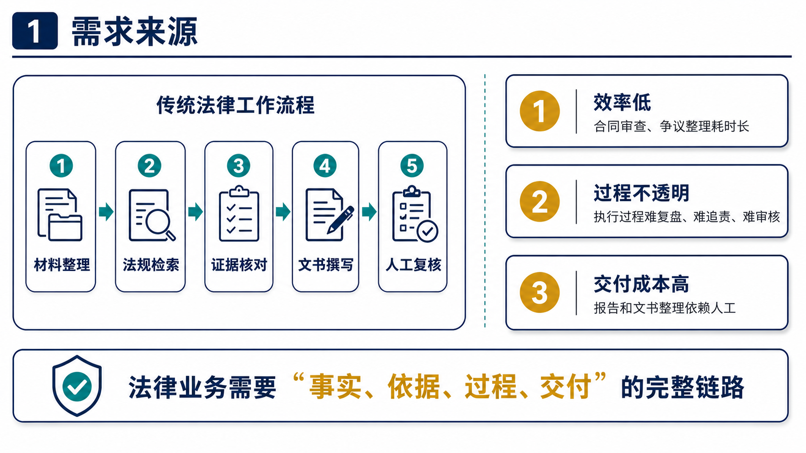

---

## P2 用户场景

标题：用户场景

内容：

- 个人律师：合同审查、争议整理、文书起草
- 律所团队：案件归档、文书标准、流程复盘
- 企业法务：合同风险、公司事务、合规内控
- 合规人员：法规研究、风险识别、整改建议

画面：

- 左侧：四类用户
- 右侧：典型业务任务表
- 底部：覆盖高频法律任务场景

配图：

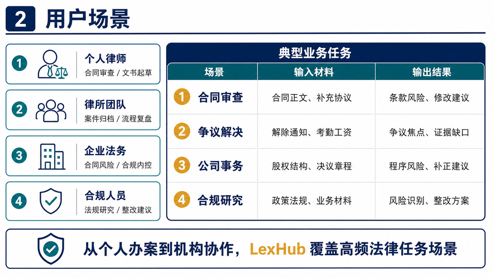

---

## P3 产品定位

标题：产品定位

内容：

- 律枢 LexHub
- 基于 Co-Sight 的法律行业超级智能体工作台
- 覆盖材料接入、依据检索、智能体协作、结果交付、过程复盘
- 适用于合同审查、争议解决、公司事务、合规研究、文书起草等任务

画面：

- 中间：LexHub 产品定位
- 下方：五步能力链路
- 底部：系统化、可复核、可交付

配图：

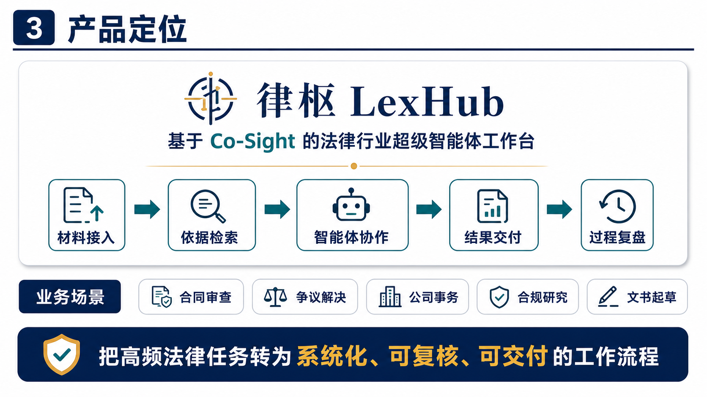

---

## P4 双端架构

标题：双端架构

内容：

- 用户端：场景选择、任务描述、材料上传、执行查看、结果导出
- 管理端：模型配置、API 管理、知识库维护、工作流策略、会员标注
- 两端共用 FastAPI、Co-Sight 执行引擎、法律知识库和审计记录

画面：

- 左侧：用户端
- 右侧：管理端
- 底部：共享中台

配图：

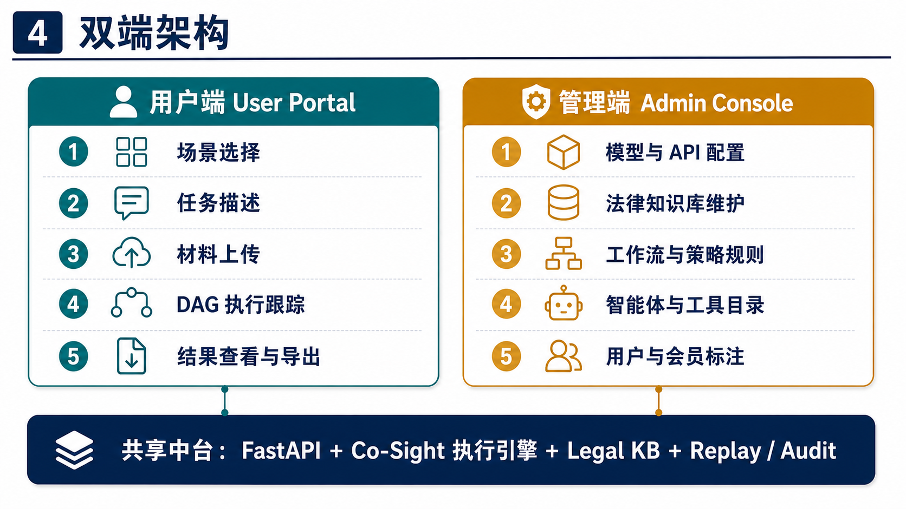

---

## P5 Co-Sight 改造

标题：Co-Sight 改造

内容：

- 保留 Planner、Actor、Tool Call、Replay 等底座能力
- 新增法律场景入口、法律任务 DAG、法规 RAG、文书导出和审计链
- 新增用户端、管理端、结果页、回放页
- 从通用智能体框架升级为法律业务智能服务平台

画面：

- 左侧：原生 Co-Sight
- 中间：法律场景化改造
- 右侧：LexHub 法律业务能力

配图：

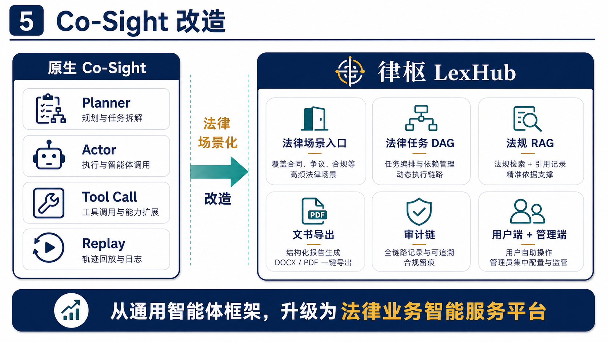

---

## P6 系统架构

标题：系统架构

内容：

- 前端：React + Vite，承载用户端和管理端
- 后端：FastAPI，提供任务、材料、知识库、导出和审计接口
- 编排：Co-Sight 执行引擎负责智能体调度、DAG 编排和工具调用
- 数据与配置：法律工作流、智能体注册、知识库种子、运行时配置

画面：

- 五层架构：用户交互层、后端服务层、智能体编排层、工具与知识层、可信数据层
- 右侧标注：可扩展、可配置、可复核

配图：

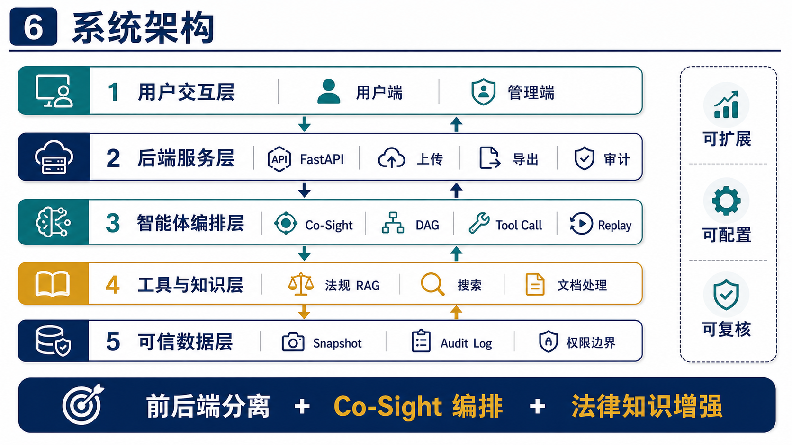

---

## P7 智能体协同

标题：智能体协同

内容：

- 任务理解智能体：识别场景、拆解任务、生成执行计划
- 证据质检智能体：检查材料完整度，输出缺口清单
- 法规研究智能体：检索法规、案例和引用依据
- 文书生成智能体：输出报告、律师函、合同草稿等交付物
- 交叉审查与合规监测智能体：负责导出前复核和审计留痕

画面：

- 中心：任务理解智能体
- 周围：五类协作智能体
- 底部：多智能体分工协作

配图：

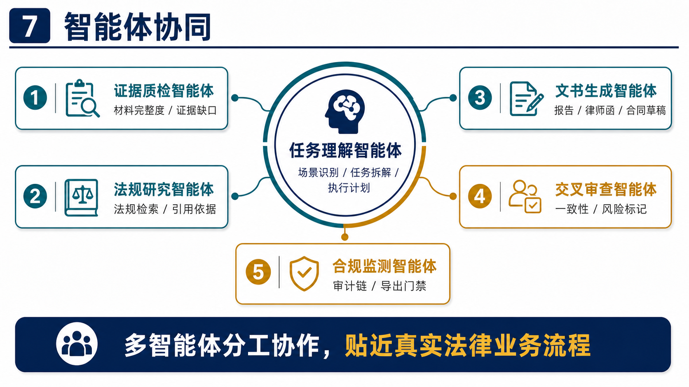

---

## P8 DAG 编排

标题：DAG 编排

内容：

- 主路径：材料接入 → 任务理解 → 法规研究 → 文书生成 → 导出交付
- 条件触发：材料完整度、引用覆盖率、风险等级、导出动作
- 材料不足时触发证据质检和材料补充
- 高风险或导出前触发交叉审查和合规监测

画面：

- 中间：DAG 主流程
- 下方：材料不足分支
- 右侧：交叉审查、合规监测、结果导出

配图：

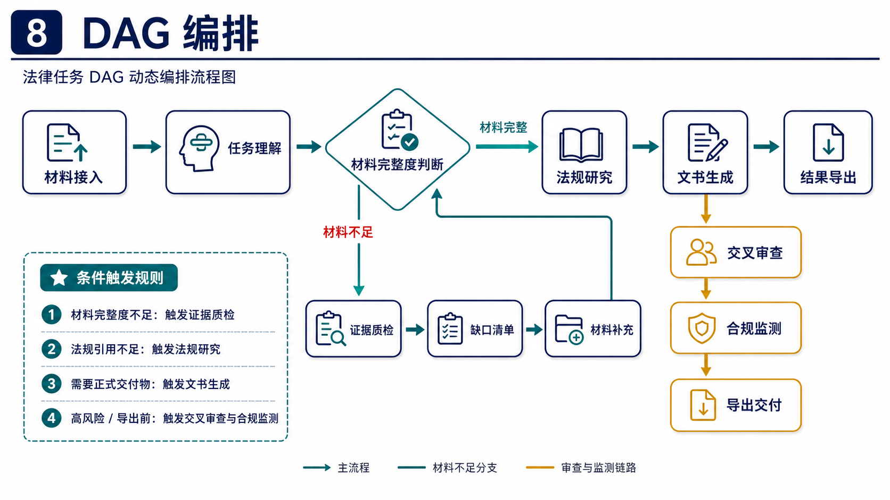

---

## P9 可信复核

标题：可信复核

内容：

- Replay：记录阶段进展、工具调用和智能体输出
- Snapshot：保存任务执行状态和关键结果摘要
- Audit Log：记录关键事件、导出动作和审计信息
- 导出溯源：文书内容可关联任务过程和依据来源

画面：

- 上方：任务输入到导出溯源的链路
- 中间：可信输出
- 下方：Replay、Snapshot、Audit Log、权限边界

配图：

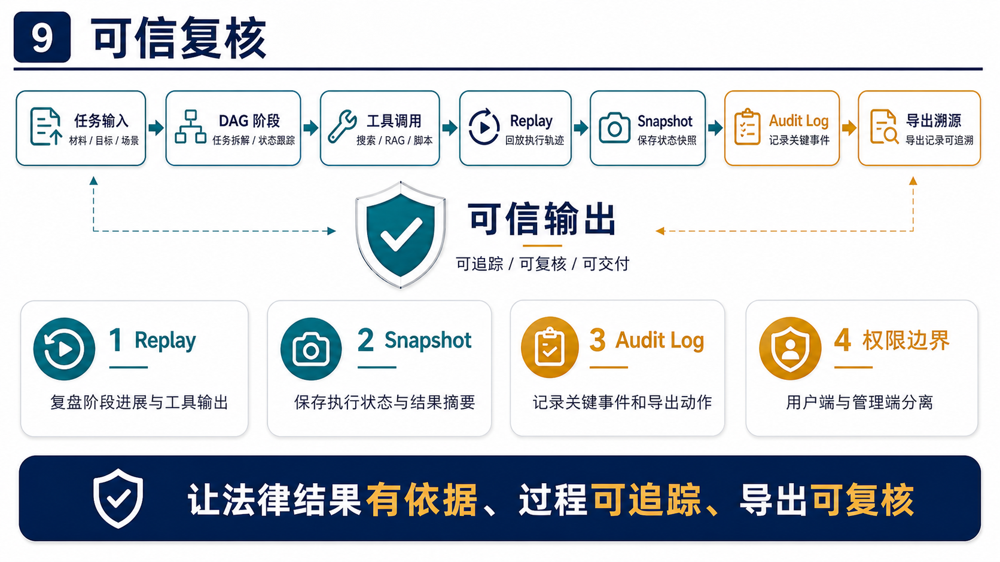

---

## P10 用户端闭环

标题：用户端闭环

内容：

- 选择业务场景
- 填写任务描述
- 上传法律材料
- 查看 DAG 执行过程
- 查看结果并导出文书

画面：

- 左侧：用户端工作台界面
- 右侧：五步操作流程
- 底部：任务输入 → Plan 拆解 → Tool Call → Agent Result → Replay

配图：

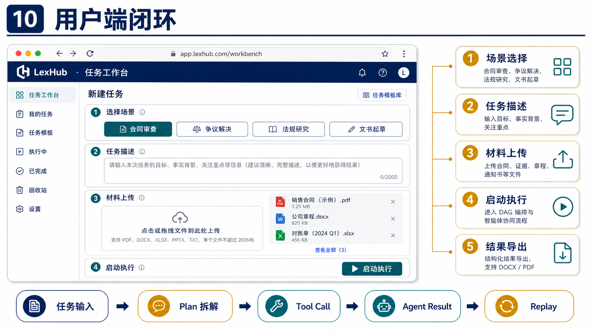

**备注：我们会用视频覆盖左侧工作台大图区域。**

---

## P11 管理端支撑

标题：管理端支撑

内容：

- 模型与 API 配置
- 法律知识库维护
- 工作流与策略规则
- 用户与会员标注
- 运行状态与审计记录查看

画面：

- 左侧：管理端控制台界面
- 右侧：配置能力卡片
- 底部：后台配置 → Co-Sight 执行能力 → 用户端任务效果

配图：

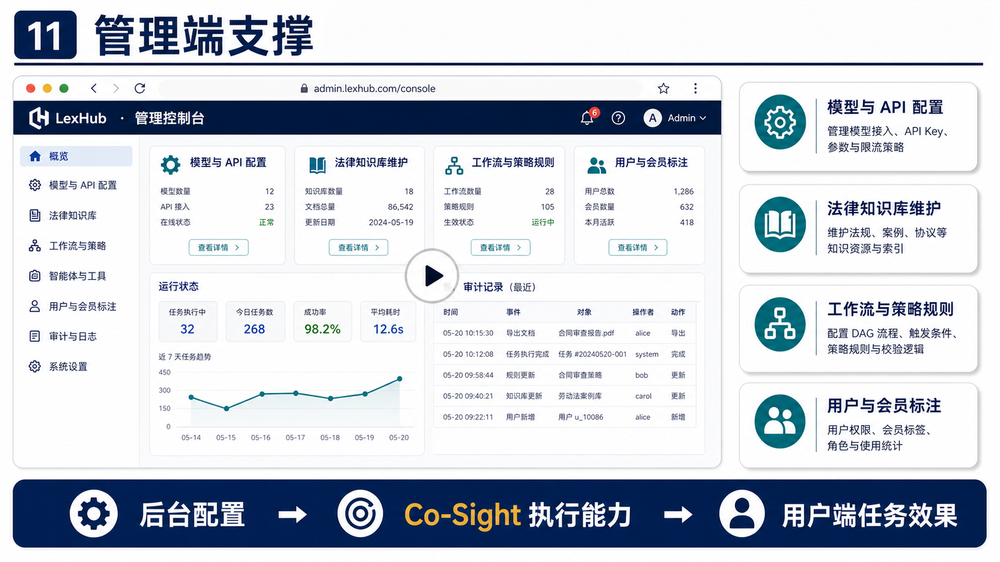

**备注：我们会用视频覆盖左侧工作台大图区域。**

---

## P12 会员方案

标题：会员方案

内容：

- 体验版 Trial：基础任务体验、DAG 执行预览、回放记录查看
- 专业版 Pro：法律智能体协同、法规检索、文书导出、回放与归档
- 旗舰版 Ultra：更高任务额度、高级工具包、优先调度、协作席位
- 机构定制：私有化部署、专属知识库、行业工作流、工具 API 对接

画面：

- 上方：体验使用 → 标准办案 → 深度使用 → 机构定制
- 中间：Trial / Pro / Ultra 三张权益卡
- 底部：机构定制横条

配图：

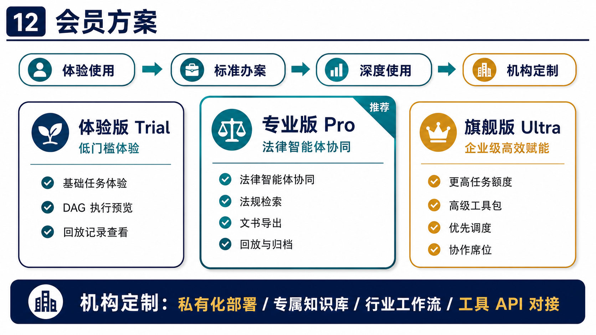

备注：不写具体价格，不写真实收费承诺。

---

## P13 社会价值

标题：社会价值

内容：

- 降低法律检索、材料整理和文书生成成本
- 提升中小主体获取法律服务的便利性
- 强化法律依据、执行过程和导出结果的可追溯性
- 扩展 Co-Sight 在法律行业的落地场景

画面：

- 中心：可编排、可追溯、可交付
- 四周：降低成本、提升可及性、强化追溯、行业扩展
- 底部：社会价值强调语

配图：

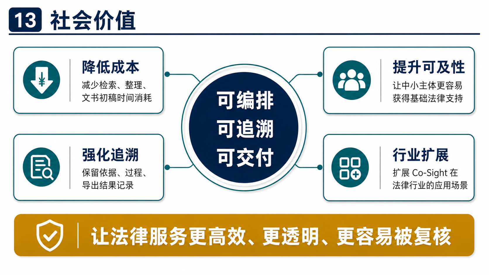
